# Administración de sistemas operativos

# Práctica 2.01 - Samba

El objetivo de esta práctica es familiarizarnos con la herramienta samba de Linux. Dicha herramienta sirve para que las máquinas linux puedan agregarse al sistema de carpetas compartidas de windows "smb/cifs". Instalaremos el servidor samba en un máquina linux y probaremos a acceder a los recursos creados en dicha máquina desde otras 2 que actuarán como clientes.

Para el desarrollo de la práctica vamos a utilizar 3 máquinas virtuales:

* Una máquina OpenSUSE, que será la que actuará como servidor samba.
* Otra máquina OpenSUSE, que actuará como cliente1.
* Una máquina Windows 7, que actuará como cliente2.

Todas las máquinas son reutilizadas de la prácticas anterior relacionada con las conexiones ssh, ya que las configuraciones realizadas en dicha práctica no suponen ningún impedimento con los procesos que tenemos que realizar en la presente práctica.

## 1. Samba - OpenSUSE

### 1.1 Preparación de la práctica

Antes de empezar, vamos a preparar las máquinas con las herramientas que necesitamos para desarrollar la práctica.

Configuramos la máquina servidor tal y como nos indica el enunciado y ejecutamos los siguientes comandos para comprobarlo:

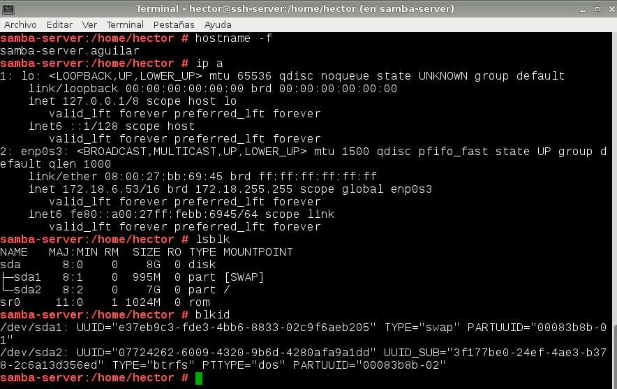

También tenemos que editar, en las 2 máquinas linux, el fichero /etc/hosts para agregar los nombres e ip de las otras 2 máquinas.

### 1.2 Usuarios locales

Ahora vamos a crear la estructura de grupos y usuarios locales que vamos a utilizar en el desarrollo de la práctica.

* Grupos: `jedis`, `sith` y `starwars`.
* Usuarios: `jedi1`, `jedi2`, `sith1`, `sith2`, `supersamba` y `smbguest` (este usuario no será accesible mediante login en el sistema).

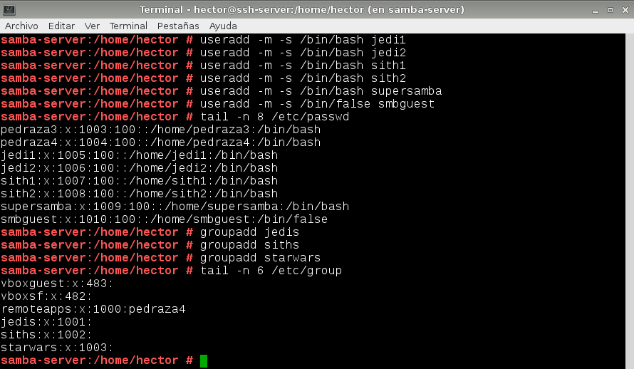

### 1.3 Instalar Samba

En este apartado vamos a instalar Samba. Dependiendo de la distribución y de la versión de Linux que estemos utilizando es probable que ya venga incluido en el sistema. En nuestro caso, como ya hemos actualizado el sistema anteriormente, además de estar instalado también se encuentra actualizado.

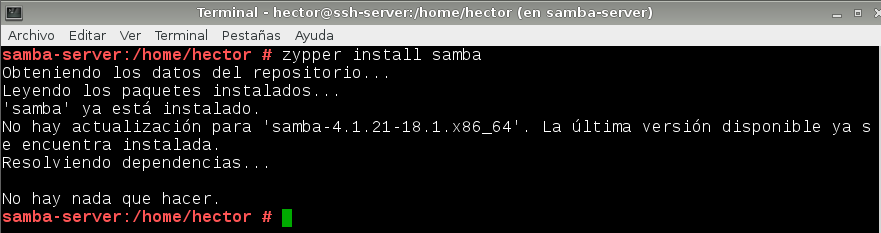

### 1.4 Carpetas para los recursos compartidos

Ahora vamos a crear las carpetas de los recursos compartidos que vamos a configurar durante la práctica.

Crearemos 3 carpetas, 1 para cada grupo de los creados (`starwars`, `siths` y `jedis`), pero todas bajo el control del usuario `supersamba`:

* Directorio `/var/samba/public.d`, permisos 775.
* Directorio `/var/samba/corusant.d`, permisos 770.
* Directorio `/var/samba/tatooine.d`, permisos 770.

El recurso public estará compartido y accesible para todos los usuarios en modo lectura.

También tendremos un recurso, denominado `cdrom`, que será el recurso dispositivo cdrom de la máquina donde está instalado el servidor samba.

### 1.5 Configurar Samba

El siguiente paso es configurar el servicio Samba.

Antes de empezar las configuraciones vamos a hacer una copia de seguridad del fichero de configuración existente.

La configuración la realizaremos mediante el entorno gráfico, por lo que vamos al yast -> Servicio Samba. Aquí tenemos que modificar varias pestañas. En primer lugar la de inicio.

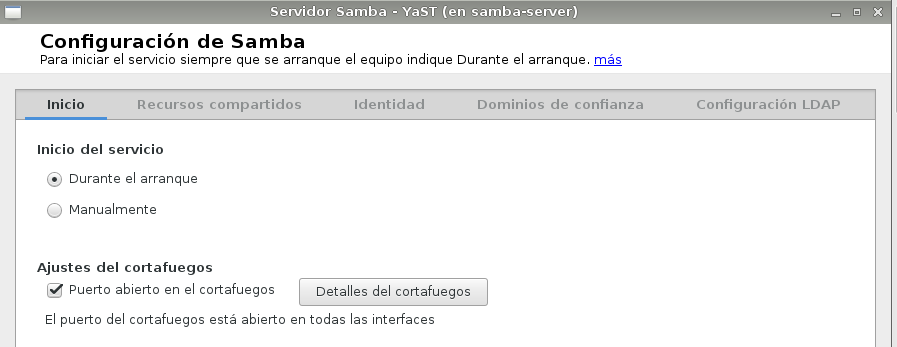

Ahora vamos a la pestaña identidad -> Configuración avanzada -> Configuración manual en modo experto y establecemos los parámetros generales del servicio.

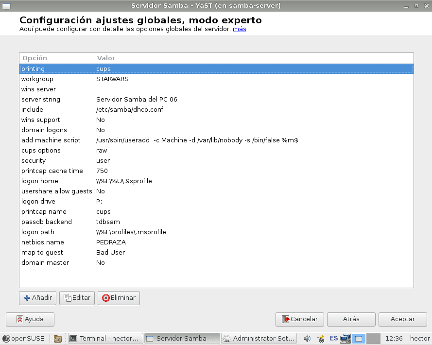

Finalmente vamos a la pantalla de recursos y creamos los recursos corusant, public y tatooine apuntando a los directorios que creamos anteriormente.

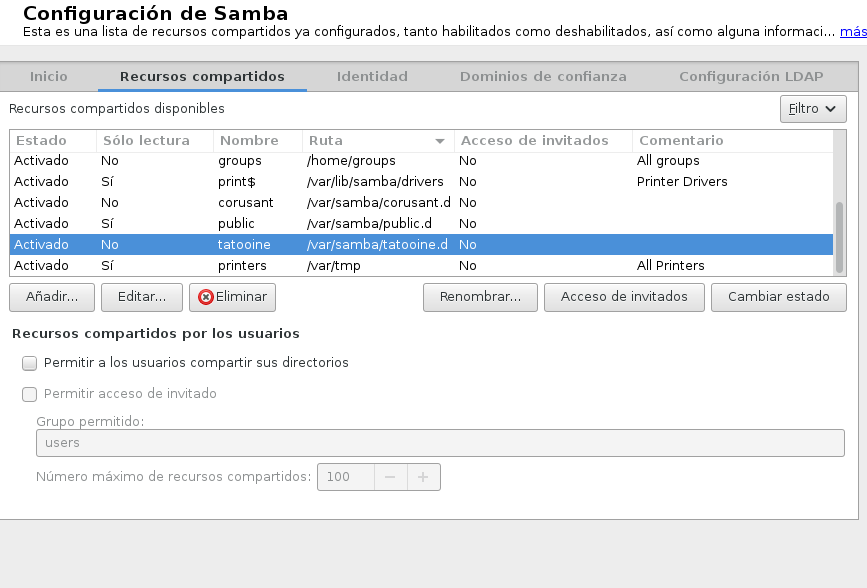

Ahora vamos a revisar el fichero de configuración de samba (/etc/samba/smb.conf) para comprobar que se ha establecido correctamente.

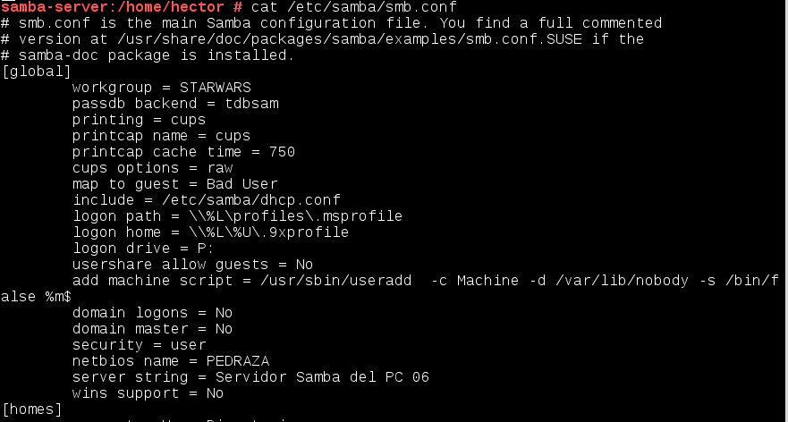

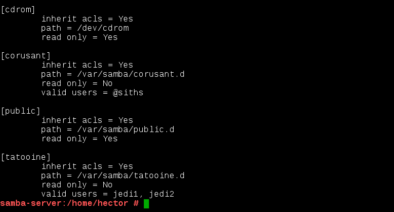

También ejecutamos el comando `testparm` para comprobaciones.

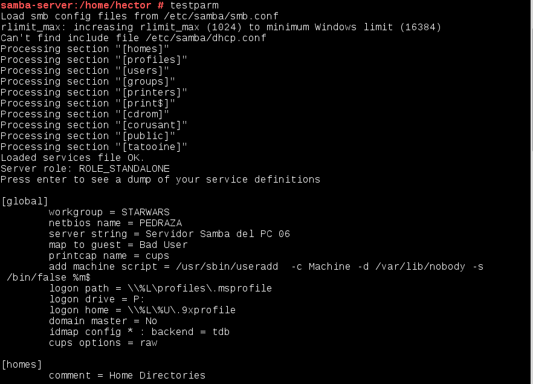

### 1.6 Usuarios Samba

Ahora vamos a agregar los usuarios del sistema que hemos creado a Samba. Para ello ejecutamos el comando `smbpasswd -a nombreusuario`

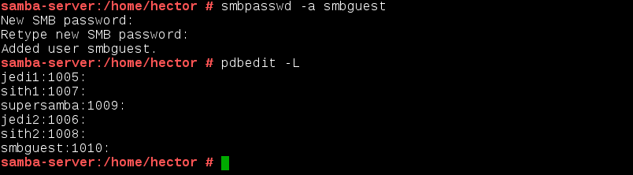

Al terminar comprobamos la lista de usuarios samba con `pdbedit -L`

### 1.7 Comprobación del servicio

Ejecutamos los comandos siguientes para comprobar las configuraciones realizadas.

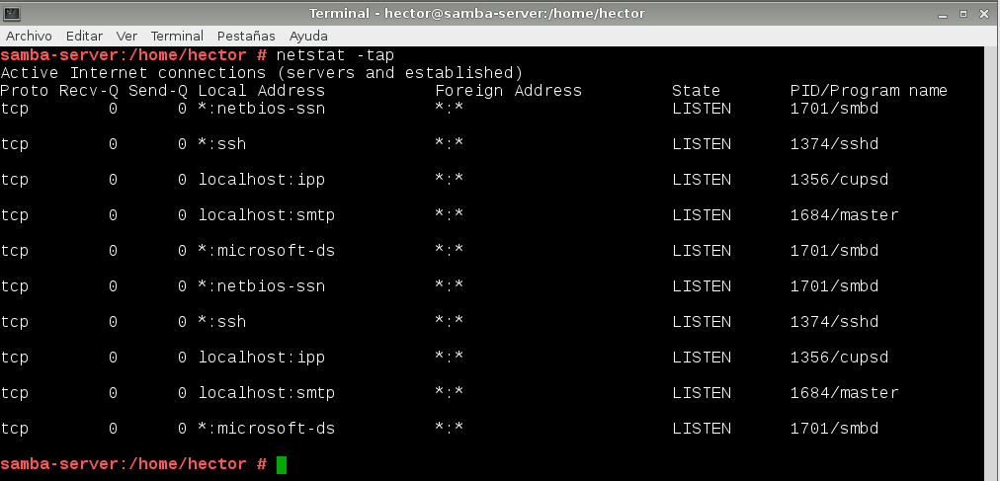

## 2. Windows

En este apartado vamos a realizar las pruebas del servicio desde la máquina cliente windows. Intentaremos acceder a los recursos compartidos del servidor samba primero desde el entorno gráfico y después mediante la línea de comandos.

### 2.1 Cliente Windows GUI

En primer lugar haremos el acceso desde el entorno gráfico. Para conectar con el servidor de recursos, abrimos el explorador de archivos y, en la barra de direcciones, escribimos la dirección `\\ip-del-servidor`.

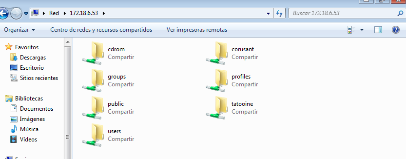

Intentamos entrar a cualquiera de los recursos y nos pide credenciales de acceso. Comprobamos que podemos acceder con todos los usuarios.

>*Nota*: cada vez que se inicia sesión con un usuario se queda guardada la información de dicho cliente, por lo que si queremos cerrar dicha conexión para establecer otra con un usuario distinto tendremos que ir a la consola y ejecutar el comando `net use * /d /y`.

Con cualquier usuario conectado, vamos al servidor y comprobamos que existe una conexión abierta con la máquina cliente mediante los comandos `smbstatus` y `netstat -ntap`.

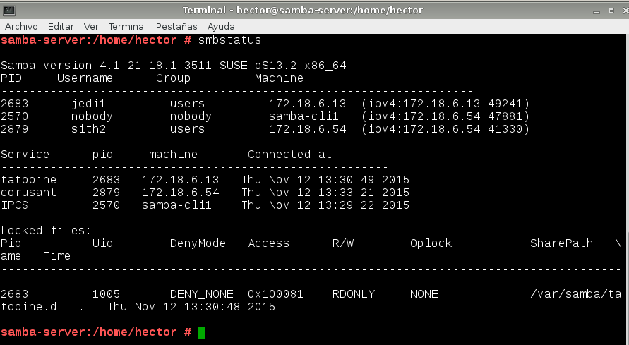

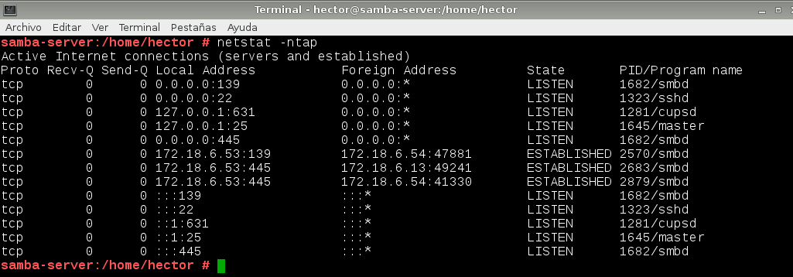

### 2.2 Cliente Windows comandos

Ahora vamos a crear las conexiones a los recursos compartidos mediante la línea de comandos.

Abrimos la consola y ejecutamos el comando del apartado anterior para cortar todas las conexiones establecidas.

> El comando para editar las conexiones del equipo es `net`, por lo que si queremos saber como realizar cada caso concreto disponemos de la ayuda `net use /?`. 

> Si lo que queremos es listar las conexiones posibles a recursos de nuestra red utilizamos el comando `net view`.

Vamos a realizar la conexión desde el cliente al servidor samba. Para ello ejecutamos el comando `net use` de la siguiente manera.

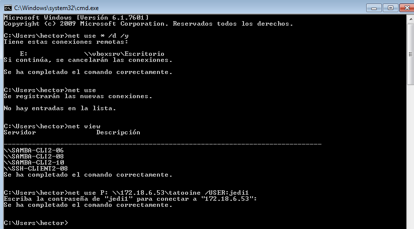

Con esto hemos mapeado el recurso compartido en la unidad "P:" de nuestra máquina, donde podremos acceder como un recurso más y realizar las modificaciones que queramos (siempre que el usuario con el que nos hemos conectado tenga permisos para hacerlo).

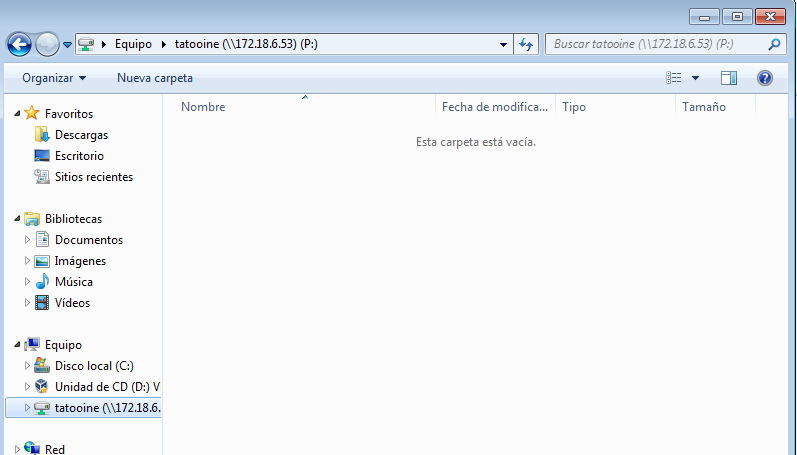 

Volvemos a ejecutar los comandos de comprobación desde el servidor.

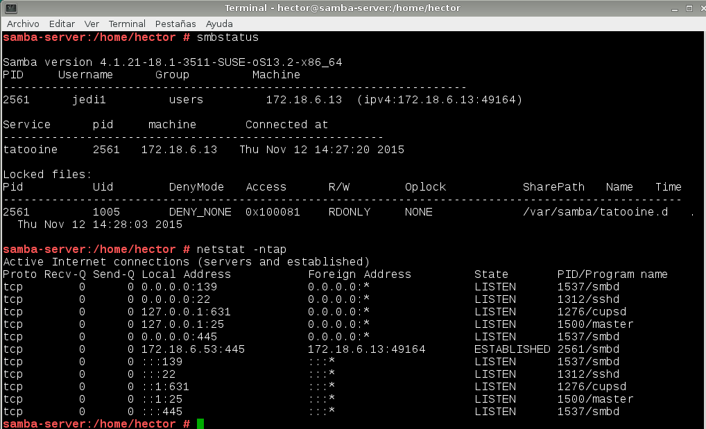

## 3. Cliente GNU/Linux

Ahora vamos a realizar las conexiones desde el cliente linux, empezando por el procedimiento en el entorno gráfico y, posteriormente, mediante la línea de comandos.

### 3.1 Cliente GNU/Linux GUI

En este caso tenemos varias formas de realizarla. La más sencilla y directa es seguir los mismos pasos que en el cliente windows: abrimos el sistema de archivos y, en la barra de direcciones, escribimos `smb://nombre-del-servidor` (también podemos indicar la ip en caso de no tener ningún tipo de direccionamiento dns). También podemos utilizar, dependiendo de la distribución linux que estemos utilizando, una opción del sistema de archivos denominada "conectar al servidor".

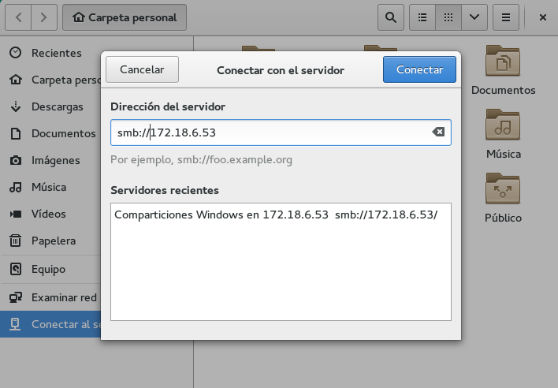

Una vez establecida la conexión, accedemos al recurso `corusant` primero y a `tatooine` después y comprobamos que podemos crear documentos. También probamos que el recurso `public` es de sólo lectura.

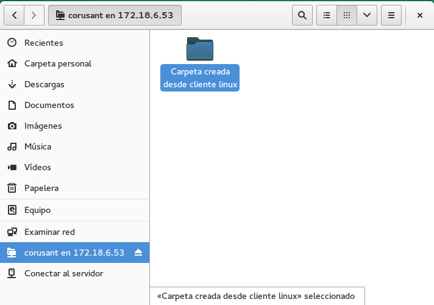

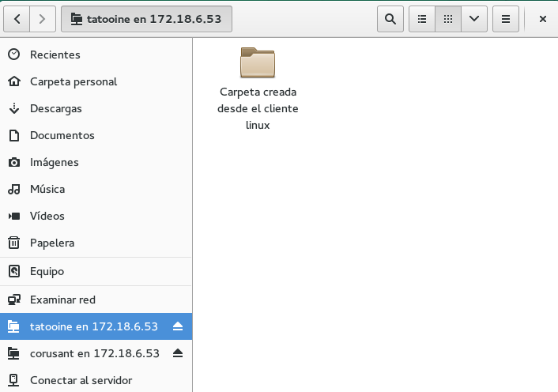

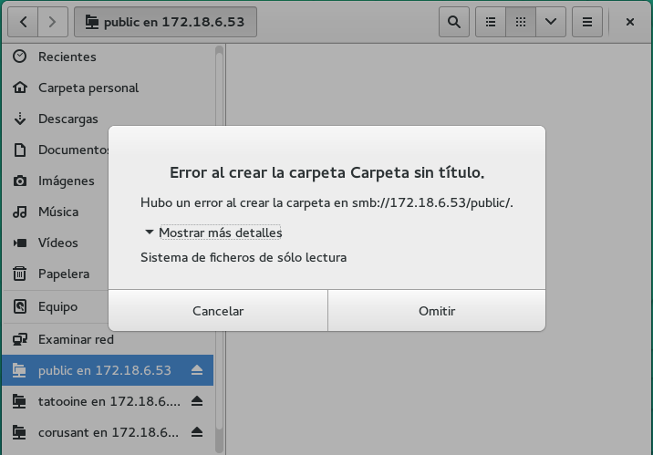

Vamos ahora al servidor para lanzar los comandos de comprobación

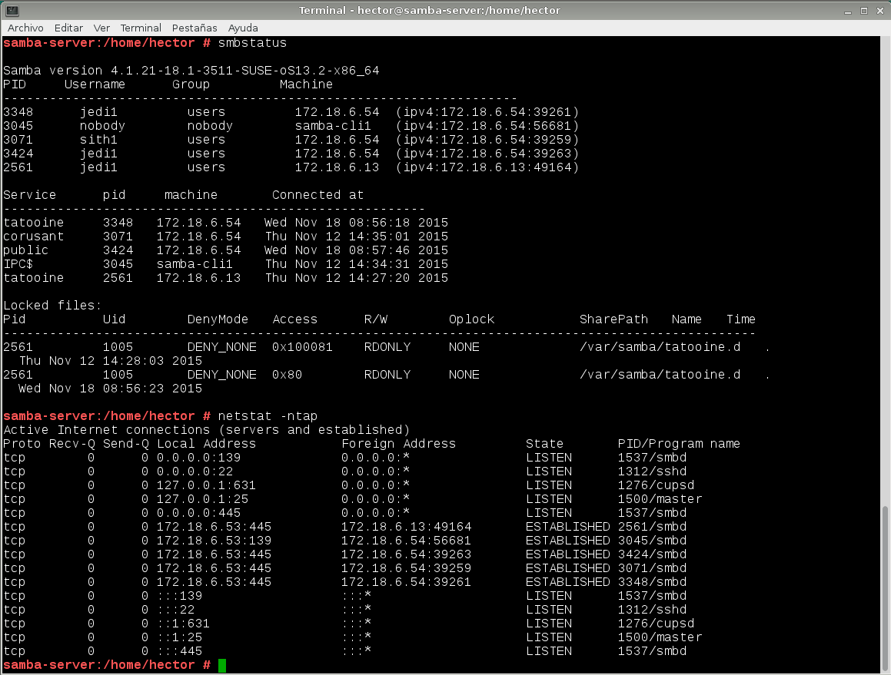

### 3.2 Cliente GNU/Linux comandos

Lo primero que vamos a hacer desde la línea de comandos es ejecutar el comando `smbclient --list ip-servidor-samba` para listar todos los recursos SMB/CIFS disponibles del servidor.

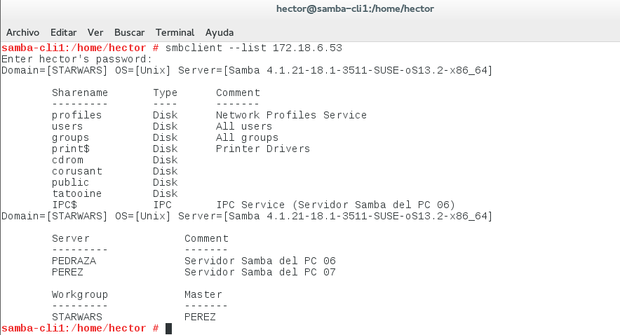

Ahora vamos a hacer como en el caso de windows: cogeremos un recurso compartido del servidor y lo montaremos bajo un directorio local. Por tanto, crearemos primero el directorio `/mnt/samba-remoto/corusant`, donde montaremos el recurso compartido.

Entramos con el usuario root y hacemos el montaje de la siguiente manera:

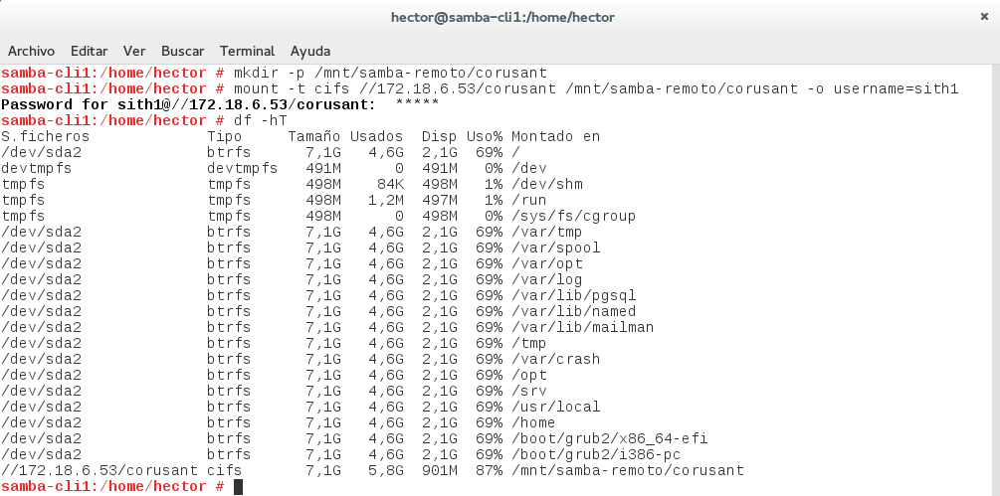

Con esto ya tenemos el recurso compartido montado en nuestro equipo y listo para utilizar.

### 3.3 Montaje automático

En este apartado vamos a configurar el fichero `/etc/fstab` para que el montaje del recurso compartido en nuestro directorio local se realice de forma automática durante el inicio del sistema.

La línea que tenemos que agregar al fichero es la que se ve al final de la imagen:

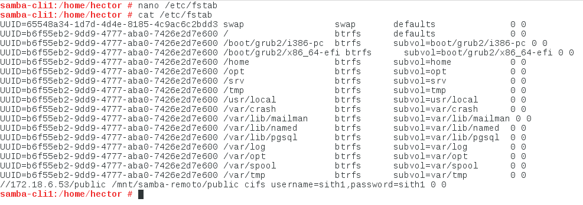

Una vez modificado el fichero reiniciamos el equipo y ejecutamos el comando `df -ht` para comprobar que el recurso se encuentra montado.

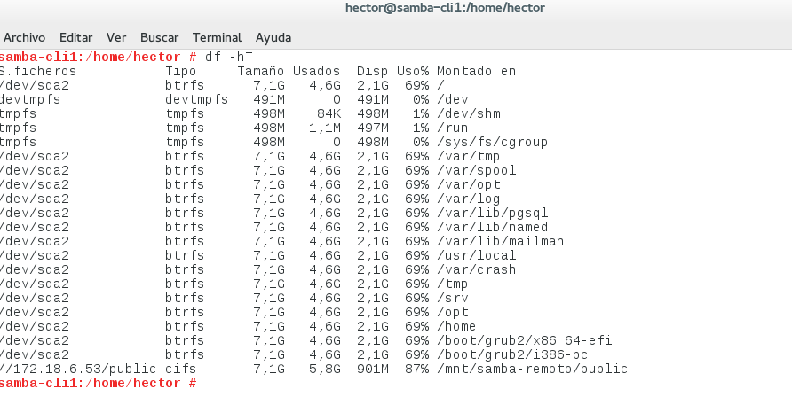

## 4. Preguntas a resolver

* ¿Las claves de los usuarios en GNU/Linux deben ser las mismas que las que usa Samba?

No es necesario que las claves coincidan.

* ¿Puedo definir un usuario en Samba llamado sith3, y que no exista como usuario del sistema?

No, todos los usuarios que se agreguen a samba deben estar creados previamente en el sistema.

* ¿Cómo podemos hacer que los usuarios sith1 y sith2 no puedan acceder al sistema pero sí al samba? (Consultar /etc/passwd)

Tal y como hicimos con el usuario `smbguest`: indicando en el fichero `/etc/passwd` que la shell con la que accederán esos usuarios al sistema es `/bin/false`.

* Añadir el recurso [homes] al fichero smb.conf según los apuntes. ¿Qué efecto tiene?

Que cada usuario podrá acceder a su home conectándose desde cualquier cliente. No podrá, aún así, acceder a los datos de los demás usuarios.

## 5. Conclusiones

Debido a la mayoría de uso de las redes windows, la herramienta Samba resulta imprescindible para integrar los sistemas linux en entornos donde predomina el uso de windows. Sin esta herramienta, los sistemas linux no podrían acceder al sistema de red que utilizar windows, el SMB/CIFS, impidiendo que pueda acceder a recursos de los servidores de la red y quedando "aislado" de los mismos. De ahí que la mayoría de las distribuciones linux vengan ya con la herramienta instalada por defecto y con otras entornos de fácil configuración y uso de la misma.

Desde otro punto de vista, también permite no solo la integración de máquinas linux en entornos windows sino además que el propio entorno sea más tipo linux, permitiendo establecer un sistema de recursos compartidos desde un servidor linux aunque hayan ordenadores windows en la red. 