# Administración de sistemas operativos

# Práctica 3.01 - LDAP

## 1. Servidor LDAP - OpenSUSE

### 1.1 Preparación de la práctica

Antes de empezar, vamos a preparar la máquina con las herramientas que necesitamos para desarrollar la práctica.

Configuramos la máquina servidor tal y como nos indica el enunciado y ejecutamos los siguientes comandos para comprobarlo:

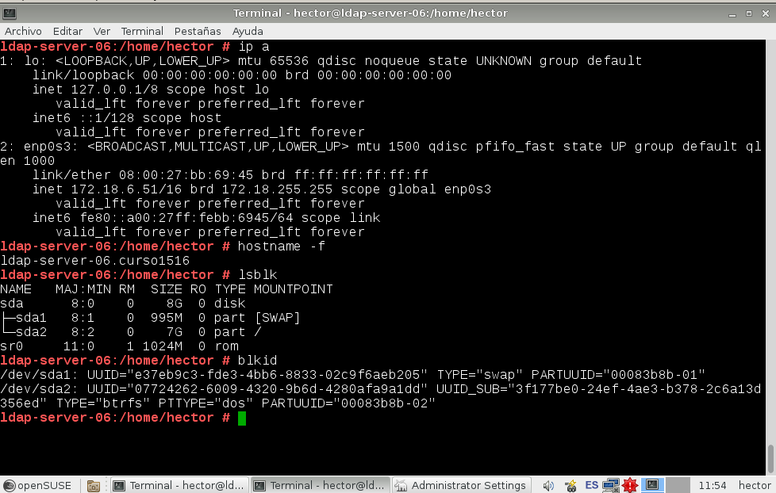

También tenemos que editar, el fichero /etc/hosts para agregar los nombres e ip de las otras 2 máquinas.

### 1.2 Instalación del servidor LDAP

Comenzaremos la práctica instalando el servicio LDAP en el servidor. Para ello tenemos que instalar el paquete OpenLDAP. Como además queremos aprovechar la funcionalidad del YaST de OpenSUSE, instalaremos también los módulos de configuración para LDAP, que se llaman `yast2-auth-client` y `yast2-auth-server`.

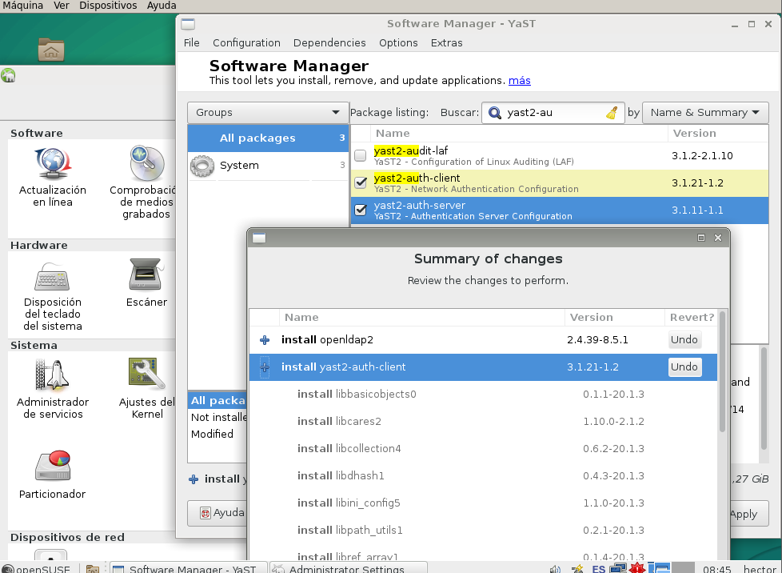

Una vez instalados los paquetes abrimos la herramienta YaST y ejecutamos el servidor de autenticación. Es posible que al intentar ejecutar el servicio nos obligue a instalar el protocolo de seguridad Kerberos. Aceptamos y comenzaremos a configurar el servicio.

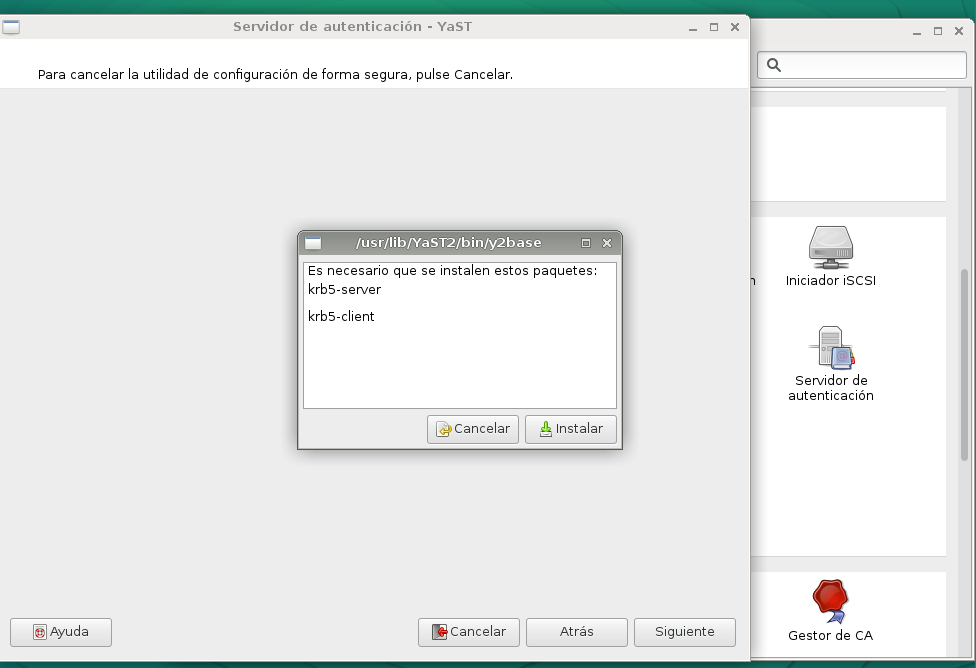

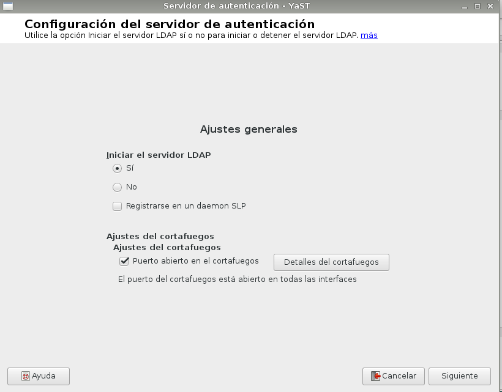

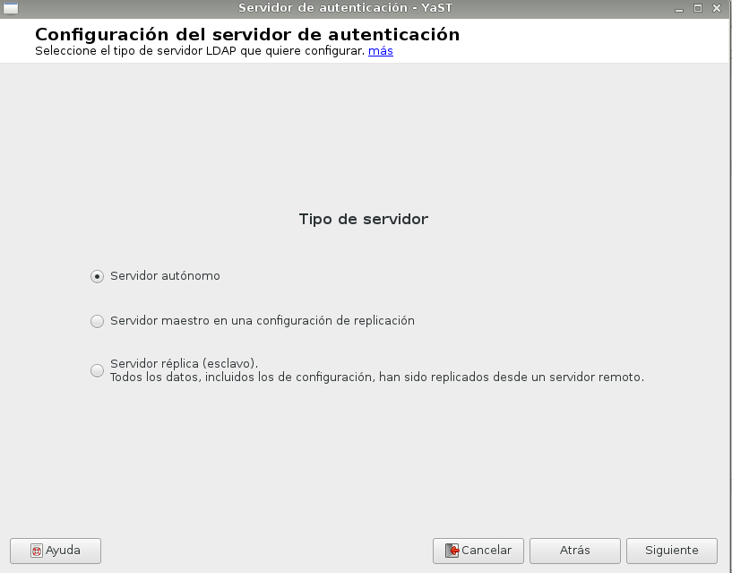

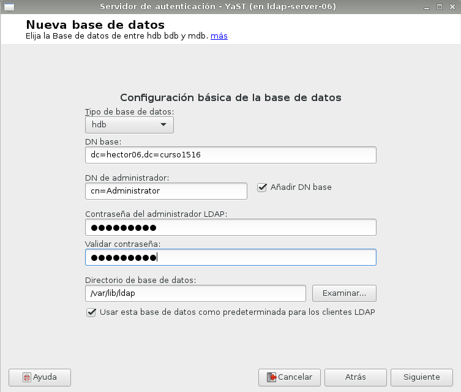

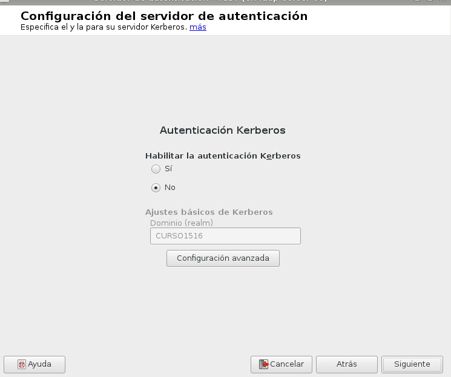

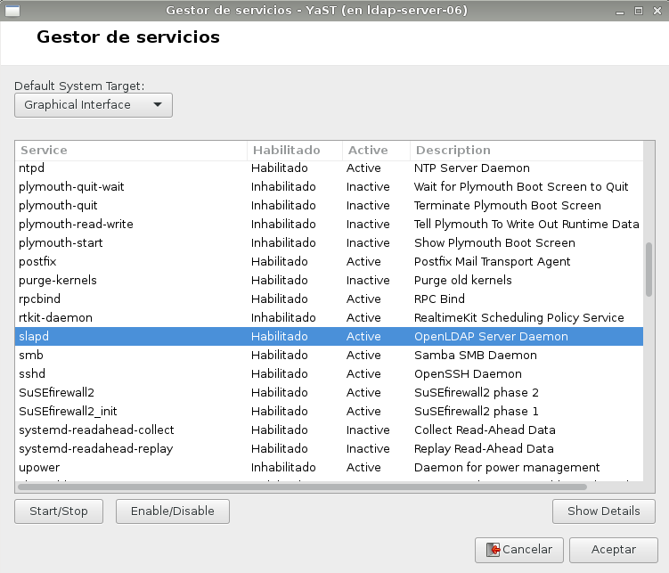

### 1.3 Crear usuarios y grupos en LDAP

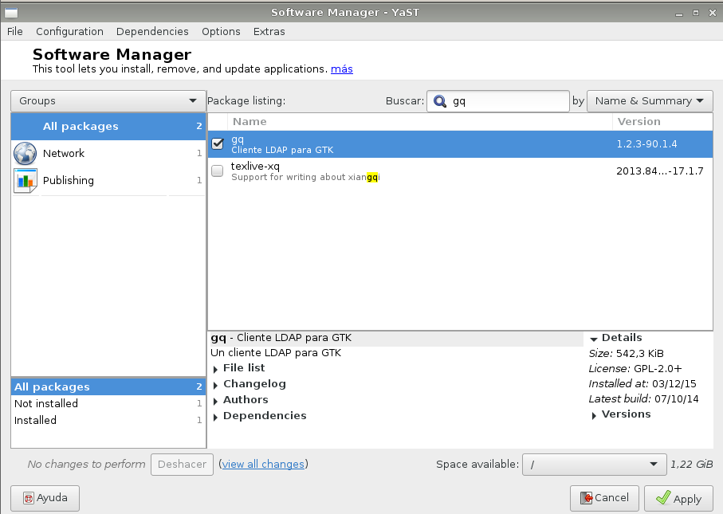

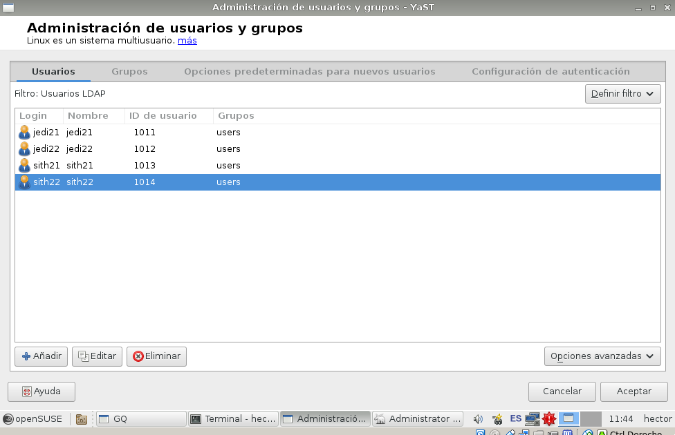

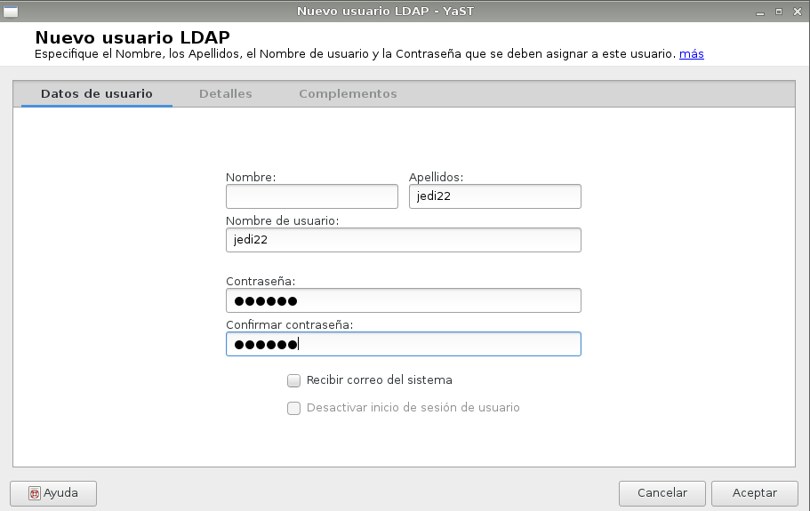

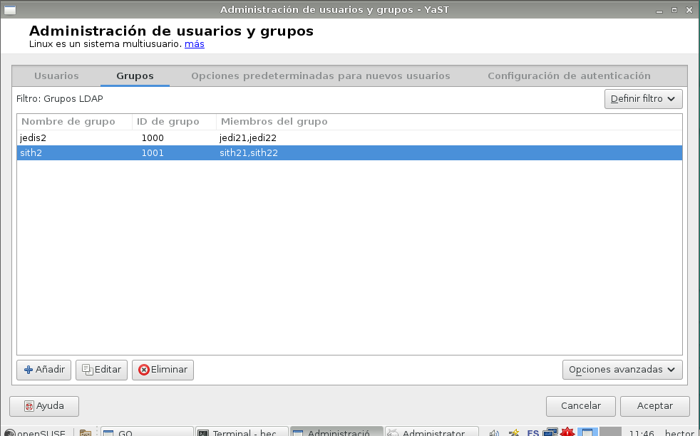

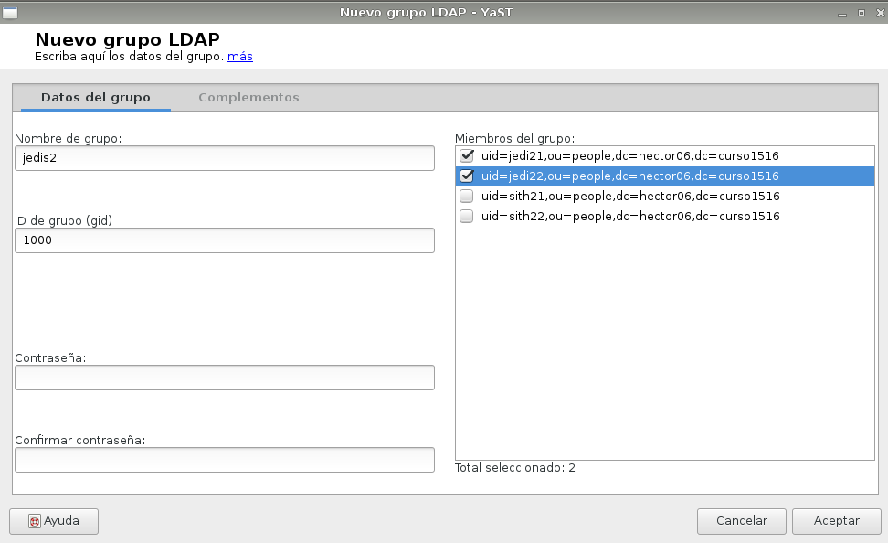

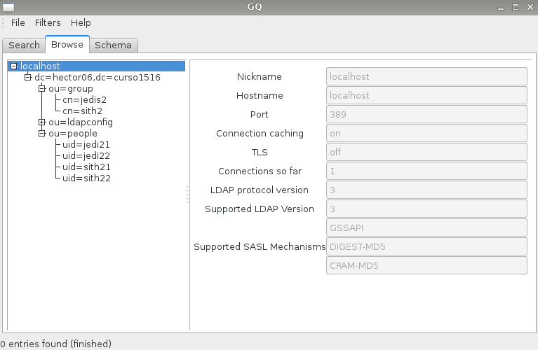

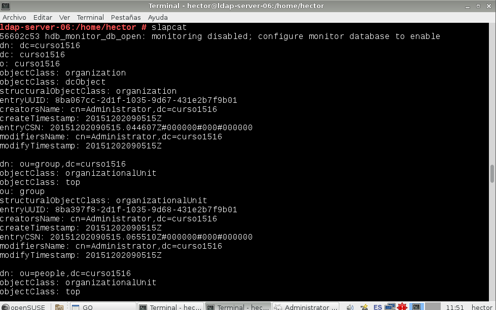

### 1.4 Autenticación

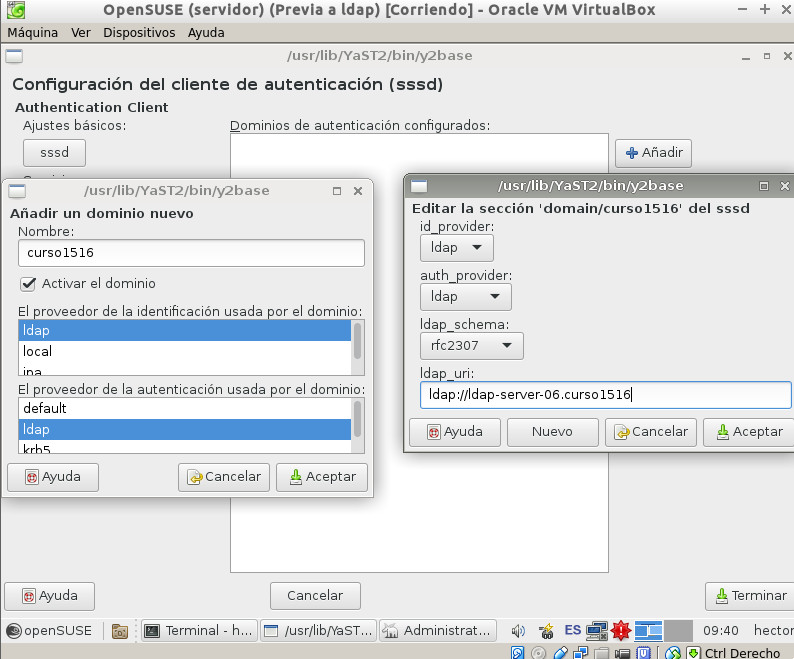

## 2. Otro equipo

### 2.1 Preparativos

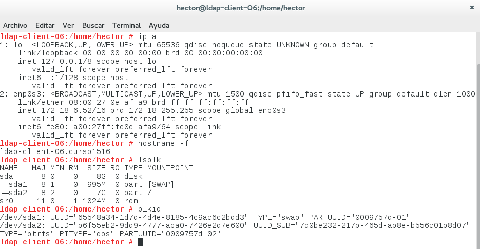

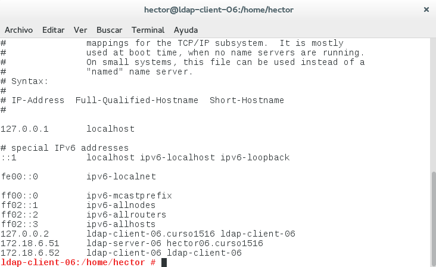

### 2.2 Configuración

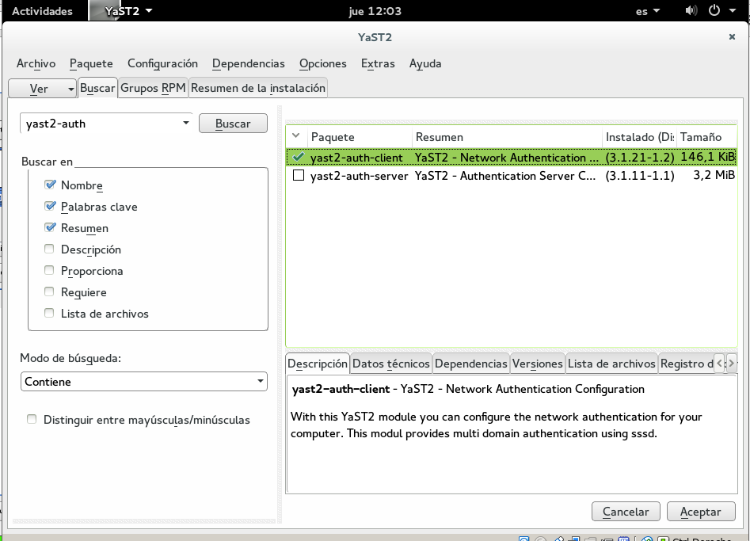

## 3. Conclusiones

