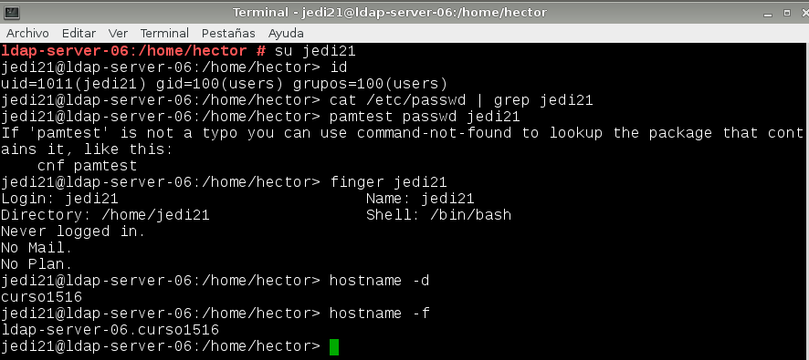

# Administración de sistemas operativos

# Práctica 3.01 - LDAP

El objetivo de esta práctica es tomar contacto con el protocolo LDAP. LDAP es un protocolo ligero de acceso a directorios cuyo uso principal es el almacenamiento de información para autenticación de usuarios, aunque puede ser utilizado para otros fines, ya que se trata, en definitiva, de una base de datos.

LDAP se caracteriza por guardar la información de manera que las acciones de inserción en datos son complejas y costosas, mientras que las acciones de lectura, gracias a la estructura que tiene, son extremadamente rápidas.

En nuestro caso vamos a implementar un sistema de autenticación mediante la herramienta OpenLDAP. Utilizaremos una máquina servidor OpenSUSE que alojará el servicio de autenticación y otra máquina OpenSUSE "esclavo" que se autenticará en el servidor.

## 1. Servidor LDAP - OpenSUSE

### 1.1 Preparación de la práctica

Antes de empezar, vamos a preparar la máquina con las herramientas que necesitamos para desarrollar la práctica.

Configuramos la máquina servidor tal y como nos indica el enunciado y ejecutamos los siguientes comandos para comprobarlo:

También tenemos que editar, el fichero /etc/hosts para agregar los nombres e ip de las otras 2 máquinas.

### 1.2 Instalación del servidor LDAP

Comenzaremos la práctica instalando el servicio LDAP en el servidor. Para ello tenemos que instalar el paquete OpenLDAP. Como además queremos aprovechar la funcionalidad del YaST de OpenSUSE, instalaremos también los módulos de configuración para LDAP, que se llaman `yast2-auth-client` y `yast2-auth-server`.

Una vez instalados los paquetes abrimos la herramienta YaST y ejecutamos el servidor de autenticación. Es posible que al intentar ejecutar el servicio nos obligue a instalar el protocolo de seguridad Kerberos. Aceptamos y comenzaremos a configurar el servicio.

Marcamos el inicio del servicio LDAP y el agregado de exepción al cortafuegos. Continuamos.

La siguiente cuestión es si nuestro servidor funcionará por si solo o junto con otros servidores de LDAP. En nuestro caso vamos a implementar un servidor autónomo.

Ahora tenemos que configurar la información de la base de datos. Indicamos el nombre de la base de datos y el usuario administrador de la misma y continuamos.

En nuestro caso, aunque lo hemos instalado porque así lo requería la aplicación, no vamos a habilitar la autenticación mediante el protocolo Kerberos. Seleccionamos "no" y continuamos. 

Una vez terminada la configuración, abrimos los servicios para comprobar que este se encuentra activo y habilitado para el arranque del sistema.

Cuando terminemos las comprobaciones reiniciamos la máquina para comenzar a introducir datos en el LDAP.

### 1.3 Crear usuarios y grupos en LDAP

En este apartado vamos a introducir la información de los usuarios y grupos de LDAP.

Lo primero que tenemos que hacer es descargar un explorador o visor de LDAP. En nuestro caso podemos utilizar por ejemplo el programa "gq".

Antes de utilizar el programa vamos a crear los usuarios y grupos. Para ello vamos al YaST -> Gestión de usuarios y grupos. Mediante esta herramienta podemos gestionar tipos de usuario y de grupos que se pueden definir en el sistema, entre ellos los de LDAP. Para modificarlo, seleccionamos el filtro adecuado a la derecha de la pantalla.

Vamos a crear 4 usuarios, que llamaremos `jedi21`, `jedi22`, `sith21` y `sith22`. Para ello vamos a la opción de añadir, donde le damos nombre y contraseña al usuario.

Ahora cambiamos a la pestaña de grupo para realizar el mismo procedimiento con estos. Crearemos los grupos LDAP `jedis` y `siths`. Cambiamos el filtro para grupos LDAP y le damos a agregar.

En este caso, como los usuarios ya están creados, podemos seleccionar en el cuadro de la derecha los que estarán incluidos dentro del grupo.

Ahora sí, ejecutamos el explorador LDAP que instalamos antes. Como vemos, los usuarios y grupos se crean respectivamente en las ou `group` y `people`, creadas por defecto.

Ya tenemos el LDAP configurado. Si queremos revisar toda la configuración, podemos hacerlo mediante el comando `slapcat` en la consola.

### 1.4 Autenticación

En este apartado vamos a probar a autenticarnos en el propio servidor con los usuarios LDAP. Para ello vamos a YaST -> Cliente de autenticación.

Entramos a la herramienta y agregamos un dominio de autenticación, que será el local que acabamos de crear.

Luego vamos a la consola y probamos a loguear con alguno de los usuarios creados.

## 2. Otro equipo

Ahora vamos a utilizar una máquina esclavo en la que nos loguearemos con los usuarios LDAP que acabamos de crear. 

### 2.1 Preparativos

Empezamos configurando la máquina cliente como especifica la práctica. 

### 2.2 Configuración

Para poder autenticarnos en el cliente utilizaremos la misma herramienta de autenticación que en el servidor. Por tanto, tenemos que descargar el módulo correspondiente de YaST, como hicimos en el caso anterior.

## 3. Aclaraciones de la práctica

Como se puede ver, los puntos 1.4 y 2.2, correspondientes a la autenticación de los usuarios, no ha sido completada. Esto se ha debido a que se produce un error cuando intentamos introducir la contraseña de los usuarios, ya que no la reconoce. El único caso en el que es posible hacer login es mediante el superusuario de la máquina servidor, ya que no requiere de introducir contraseña para poder hacer el login.

Queda pendiente averiguar la forma de configurar la herramienta para que funcione el login de los usuarios. Es posible que el problema se deba al método de encriptación de las claves utilizado por OpenLDAP por lo que queda abierta es línea de pruebas.

## 4. Conclusiones

El protocolo LDAP aporta varias ventajas debido a las características que tiene como base de datos y la flexibilidad a la hora de poder aplicarlo a diferentes situaciones. Sería interesante utilizar esta herramienta en algún otro caso que sea aplicable para poder determinar en qué casos podemos recurrir a este tipo de herramientas y en cuáles no resulta útil aplicarlas.