# Administración de sistemas operativos

# Práctica 1.02 - Clientes ligeros con LTSP

El objetivo de esta práctica es la introducción a la herramienta de acceso remoto ssh. Comenzaremos instalando el servicio y llegaremos a configurar algunos aspectos de la conexión, como cambios de claves y restricciones a usuarios.

Para el desarrollo de la práctica vamos a utilizar 3 máquinas virtuales:

* Una máquina OpenSUSE, que será la que actuará como servidor ssh.
* Otra máquina OpenSUSE, que actuará como cliente1.
* Una máquina Windows 7, que actuará como cliente2.

> **Nota:** como novedad, en esta práctica vamos a introducir el uso de OpenSUSE para el desarrollo de la actividad. Esto se debe a que el desarrollo de esta distribución está dando mejores resultados que Debian (y sus derivados) y el entorno resulta más potente, sencillo e intuitivo.

## 1. Preparación de la práctica

Antes de empezar, vamos a preparar las máquinas con las herramientas que necesitamos para desarrollar la práctica.

En primer lugar tenemos que poner las máquinas virtuales en modo puente y configurar las interfaces. Como en esta práctica estamos trabajando con OpenSUSE, en este caso la configuración no se realiza como en debian. En OpenSUSE tenemos la herramienta YaST, un entorno de administración donde podemos configurar, mediante entorno gráfico, varias opciones de nuestro sistema, similar al funcionamiento del panel de control de windows.

Abrimos el Yast y vamos a ajustes de red. Agregamos una dirección y la configuramos tal y como se indica en el enunciado de la práctica. También tenemos que asignar nombres de host concretos y la puerta de enlace, que también se configuran en esta pantalla, en las pestañas "Nombre de Host/DNS" y "Encaminamiento".

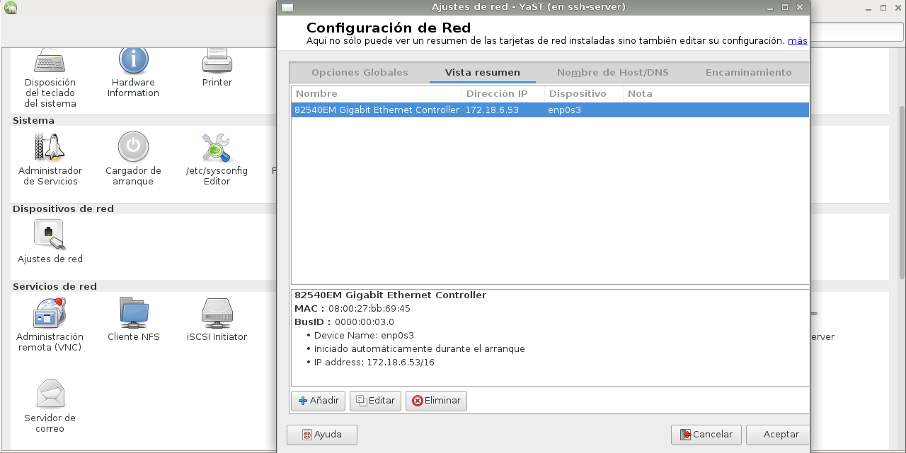

Ahora vamos a editar, en las 2 máquinas linux, el fichero /etc/hosts para agregar los nombres e ip de las otras 2 máquinas.

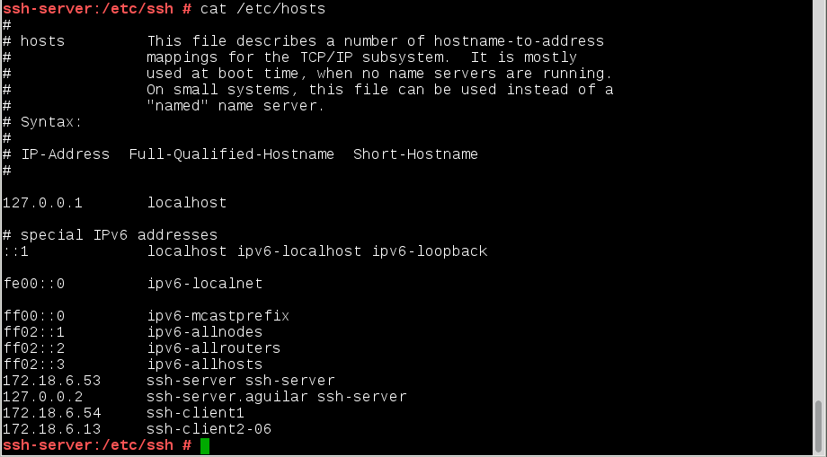

Después de la configuración vamos a ejecutar una serie de comandos para comprobar los cambios realizados. 

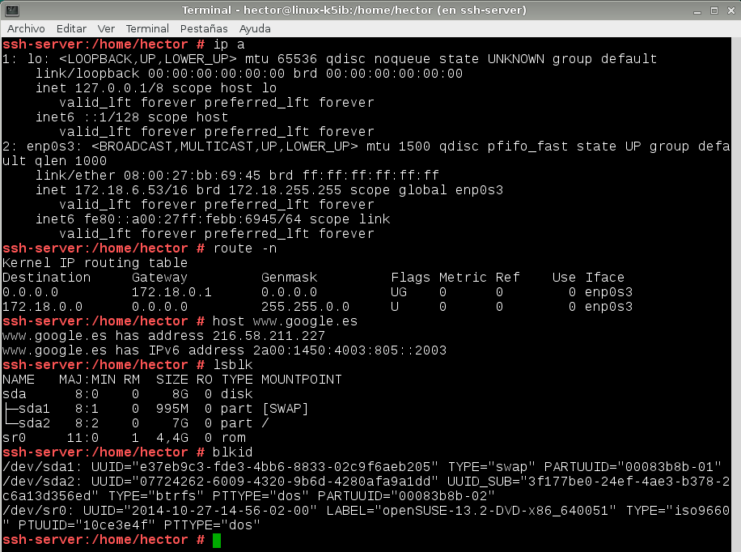

Después de las comprobaciones vamos a crear los usuarios que utilizaremos en el desarrollo de la práctica. Creamos 4 usuarios.

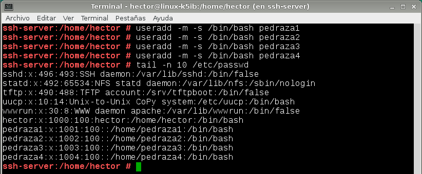

## 2. Instalación del servicio ssh

En este apartado vamos a configurar el servicio ssh y comprobaremos su funcionamiento desde los clientes.

Comenzamos instalando el servicio openssh mediante el comando `zypper install openssh`. Cuando esté instalado vamos al yast --> Administrador de servicios y comprobamos que el servicio sshd se encuentra en la lista y que además se encuentra activo y habilitado. 

> El estado habilitado indica que el servicio se inicia automáticamente cuando el sistema arranca.

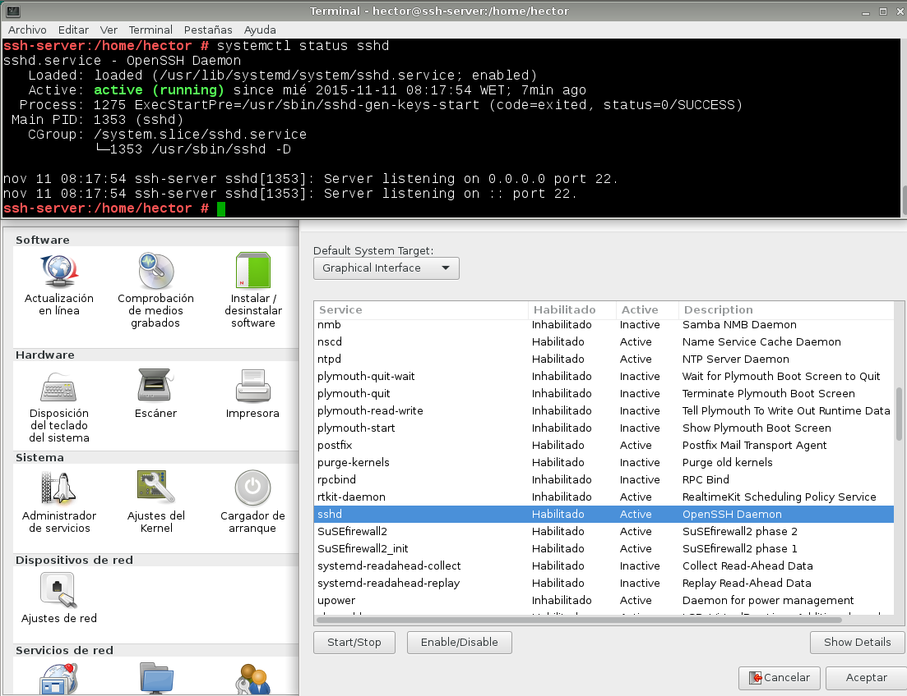

Ahora vamos a configurar las claves de comunicación del protocolo ssh. Para ello vamos al fichero `/etc/ssh/sshd_config` y comentamos todas las líneas que comienzan por "Hostkey". Estas líneas indican los distintos tipos de clave que puede utilizar el protocolo. Como nosotros vamos a establecer las conexiones por claves rsa, únicamente descomentamos la línea correspondiente a la clave rsa.

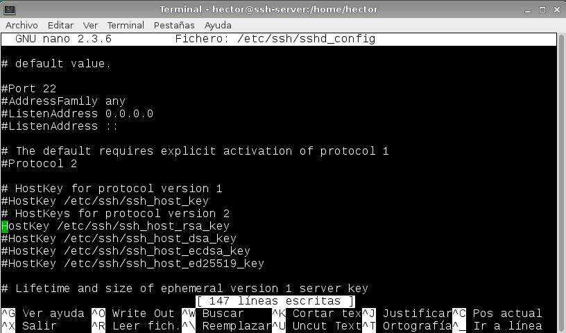

Ahora tenemos que comprobar que el puerto correspondiente al servicio ssh (22) se encuentra abierto y accesible. Para ello ejecutamos el comando `nmap`. 

Lo más probable es que el comando indique que el puerto no se encuentra accesible. Esto se debe a que OpenSUSE, al contrario que otros sistemas linux como debian, trae incorporado un cortafuegos, por lo que tenemos que ir a yast --> cortafuegos --> servicios autorizados y agregar el servicio ssh como permitido.

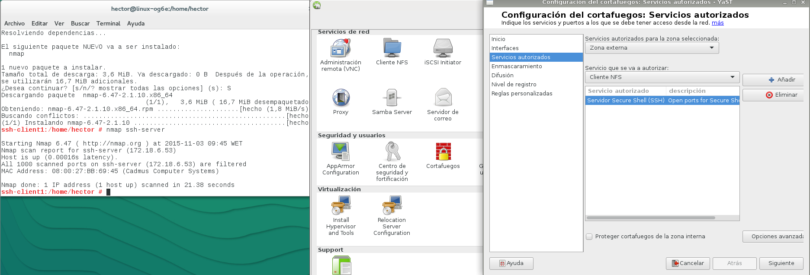

Ahora comprobamos la conexión desde los clientes. Desde el cliente linux ejecutamos el comando `ssh usuario@servidor` para conectarnos con el usuario especificado al servidor ssh.

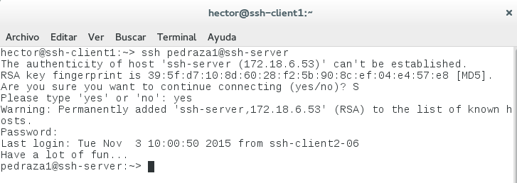

En el cliente windows necesitamos alguna herramienta que permita realizar conexiones remotas. La más sencilla de obtener y utilizar es el putty. Comprobamos el acceso al servidor.

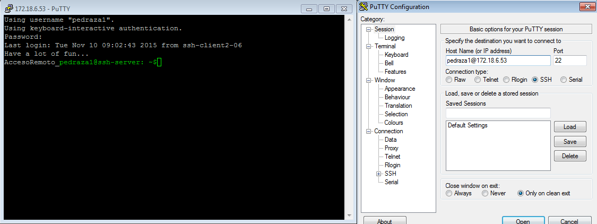

Como se puede ver en las imágenes anteriores, cuando establecemos la primera conexión nos pide confirmación debido a que el cliente no tiene registrada la clave proporcionada por el servidor. Una vez que se ha establecido la primera conexión esta clave queda almacenada en el directorio `/etc/home_del_usuario/.ssh/known_hosts`. 

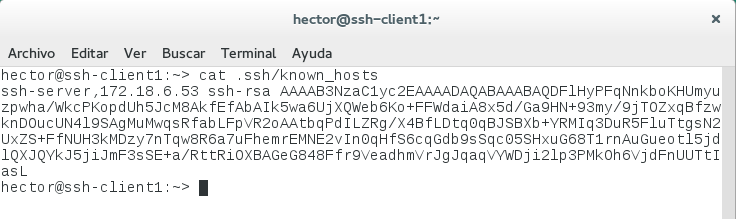

Cuando se establece la conexión ssh, el servicio comprueba que la clave que está utilizando el servidor coincide con la que ya tiene almacenada. Podemos probar modificando la clave del servidor.

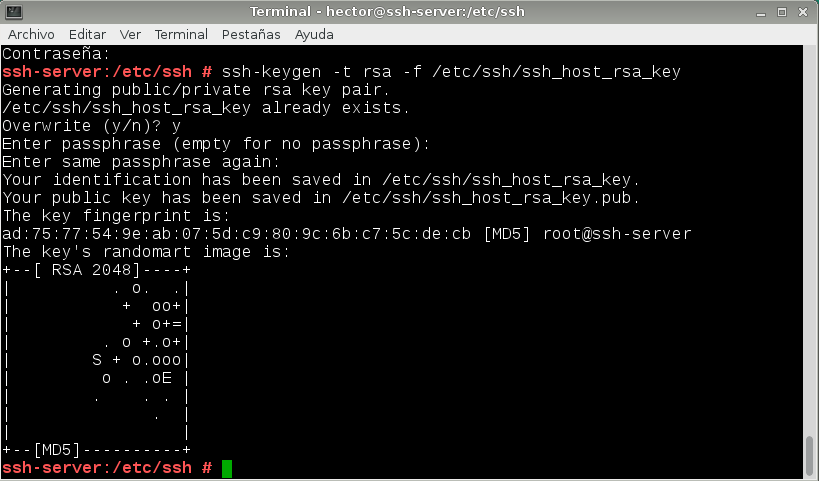

Reiniciamos el servicio y pasamos a la máquina cliente. Intentamos realizar nuevamente la conexión y comprobamos que nos aparece un aviso de que las claves no coinciden, impidiendo el acceso por un posible ataque de "man-in-the-middle". Para poder establecer nuevamente la conexión tenemos que borrar la clave que tenemos registrada de la primera conexión mediante el comando que aparece en el propio aviso del ssh. 

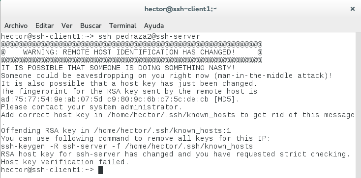

En windows, mediante el putty, también nos avisa de un cambio en las claves y de que el sitio al que estamos accediendo puede no ser seguro. Aun así, el aviso no es restrictivo y si continuamos se establece la conexión igualmente. 

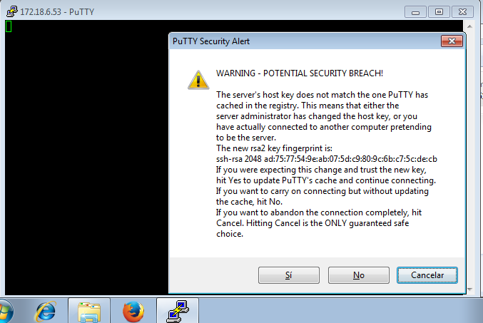

## 3. Personalización del prompt bash

En este apartado vamos a personalizar el propmt bash para los usuario que activen una sesión de ssh.

En la máquina servidor, tenemos que ir al fichero .bashrc de aquel o aquellos usuarios a los que queramos modificar el prompt: `/home/nombre-usuario/.bashrc`.

También podemos indicar alias para ese usuario: `/home/nombre-usuario/.bashrc`

Agregamos en ambos ficheros las siguientes líneas respectivamente.

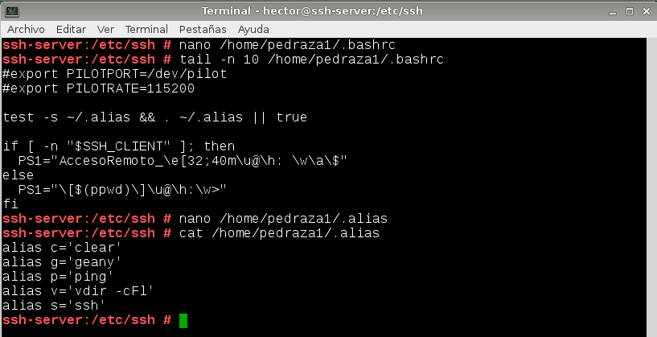

Comprobamos desde los clientes los cambios en el prompt.

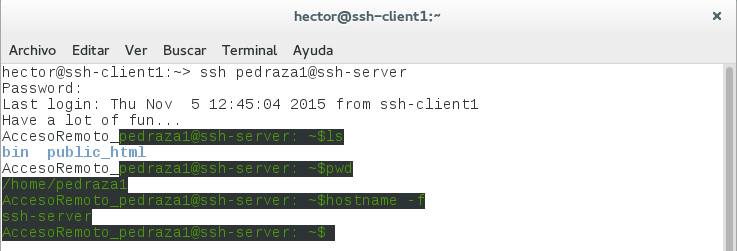

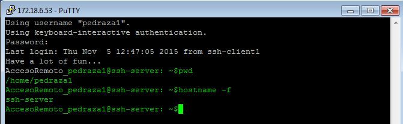 

## 4. Autenticación mediante claves públicas

En este apartado vamos a configurar las máquinas para poder acceder con uno de los usuarios creados al servidor sin tener que indicar contraseña. 

> **Nota**: tenemos que tener cuidado de no realizar este paso con el usuario root, ya que daríamos acceso sin contraseña con todos los permisos.

Iniciamos sesión con nuestro usuario de la máquina cliente y generamos un par de claves de usuario.

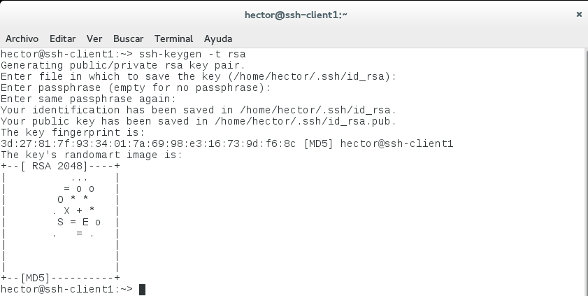

Ahora tenemos que copiar esa clave que acabamos de generar correspondiente al usuario de la máquina cliente en el fichero "authorized_keys" del usuario del servidor que queremos que se conecte sin contraseña. La forma más sencilla de hacerlo es mediante el comando `ssh-copy-id`

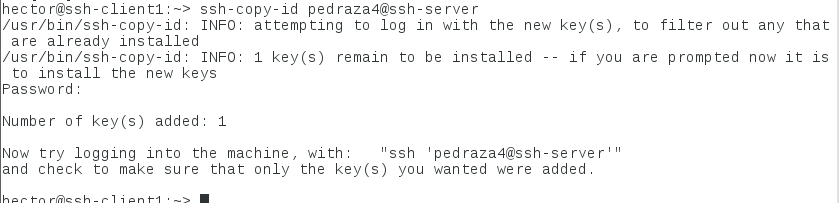

Comprobamos que podemos acceder sin especificar contraseña. Como la clave la hemos generado en el cliente1, este sistema solo funcionará desde esa máquina. Si intentamos acceder desde el cliente2 nos pedirá la contraseña como es habitual.

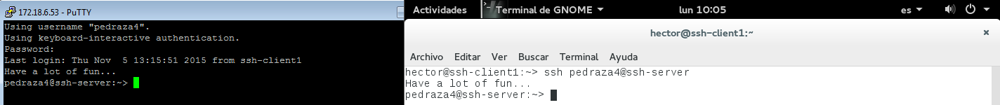

## 5. Uso de SSH como túnel para X

El objetivo de este apartado es poder ejecutar una aplicación de entorno gráfico en el servidor con un usuario conectado por ssh.

Por tanto, en primer lugar tenemos que instalar una aplicación de entorno gráfico que podamos ejecutar en remoto, por ejemplo el geany.

Ahora tenemos que modificar la configuración del ssh para que permita la ejecución de aplicaciones gráficas. Tenemos que ir al fichero `/etc/ssh/sshd_config` y establecer la opción `X11Forwarding yes` (comprobar que no se encuentra comentada).

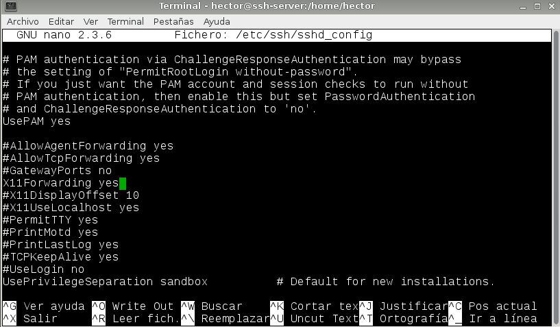

Ahora vamos al cliente1 y comprobamos a conectarnos. Para ello tenemos que ejecutar el ssh con la opción -X (mayúscula).

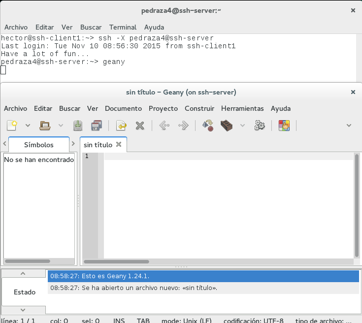

## 6. Aplicaciones Windows nativas

Ahora vamos a permitir la instalación de aplicaciones nativas de windows en nuestro servidor ssh. Utilizaremos el emulador de windows WINE.

Instalamos el WINE y alguna aplicación exclusiva de windows. En nuestro caso utilizaremos el notepad, que viene incluido con la instalación de wine.

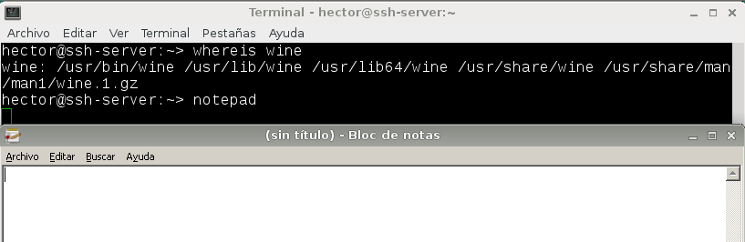

Ahora accedemos al servidor desde remoto y probamos a ejecutar el notepad.

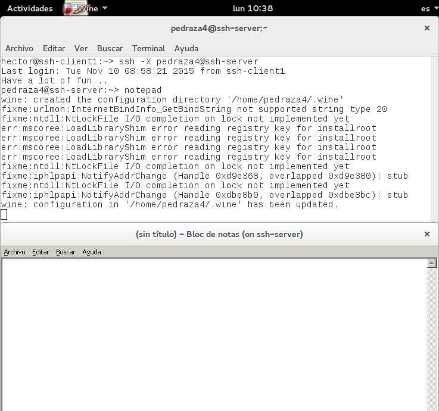

No tiene sentido comprobar la ejecución desde el cliente2, ya que este es windows, donde estarían las aplicaciones instaladas directamente.

## 7. Restricciones de uso

Para terminar, vamos a modificar los usuarios del servidor ssh para añadir restricciones de uso del ssh.

Dejaremos un usuario sin restricciones, permitiendo su acceso como hasta ahora.

### Restricción total.

Ahora vamos a establecer una restricción para otro usuario: impediremos que este usuario pueda acceder desde remoto, aunque podrá seguir accediendo en local.

Para hacer esta restricción tenemos que ir al fichero de configuración `/etc/ssh/sshd_config` y establecer las opciones `AllowUsers`, `DenyUsers` de forma que cumplan los requisitos establecidos. Para ver el comportamiento de estas opciones podemos ver la ayuda del documento con `man sshd_config` (dentro del directorio /etc/ssh).

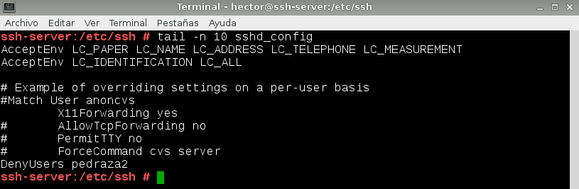

Ahora intentamos conectar con el usuario desde cualquiera de los clientes y en ninguno de los casos podremos hacerlo.

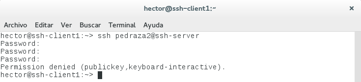

### Restricción de máquinas

El objetivo de este apartado es crear una restricción para que únicamente las máquinas con IPs autorizadas puedan acceder al servidor.

Para esto hay que realizar configuraciones en los ficheros `/etc/hosts.allow` y `/etc/hosts.deny`.

> Este apartado de la práctica no se ha realizado debido a que no ha sido posible realizar la restricción correctamente. Independientemente de la configuración establecida en los ficheros el comportamiento del ssh no se ve modificado, por lo que este subapartado queda pendiente de comprobaciones y resolución futuras.

### Restricción sobre aplicaciones

Por último, vamos a restringir las aplicaciones del servidor para que sólo aquellos usuarios autorizadas puedas ejecutarlas en remoto. Utilizaremos el geany para las pruebas.

Lo primero que tenemos que hacer es crear un grupo, que denominaremos "remoteapps", en el que incluiremos al usuario que queramos que pueda ejecutar las aplicaciones en remoto.

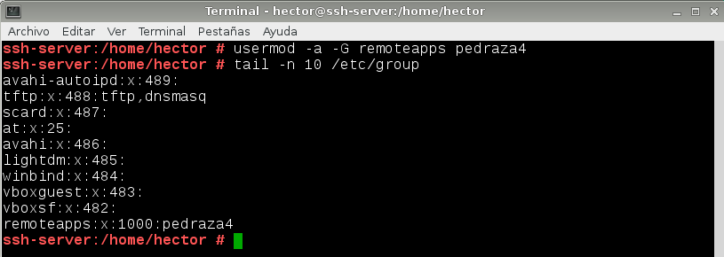

Ahora tenemos que ubicar en el equipo el programa que vamos a restringir. Para ello podemos ayudarnos del comando `whereis programa`.

Cuando tengamos ubicado el ejecutable del programa, tenemos que asignarle, mediante el comando `chgrp`, el grupo que acabamos de crear como propietario del programa. También tenemos que asignar permisos 750 para que los usuarios que no se encuentran en el grupo no puedan ejecutar el programa.

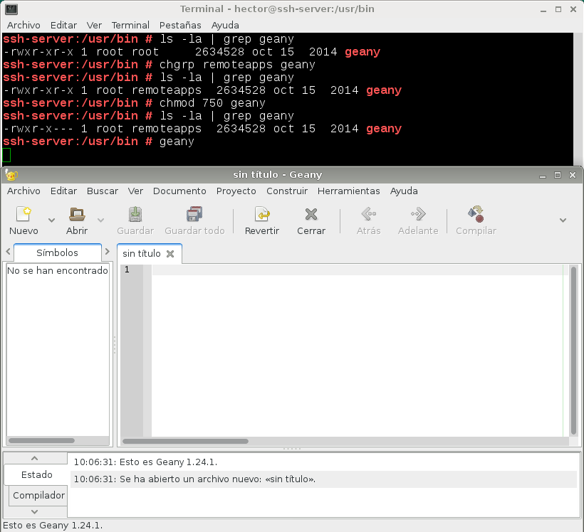

Ahora accedemos con el usuario que acabamos de autorizar para comprobar que, efectivamente, podemos ejecutar el programa desde remoto.

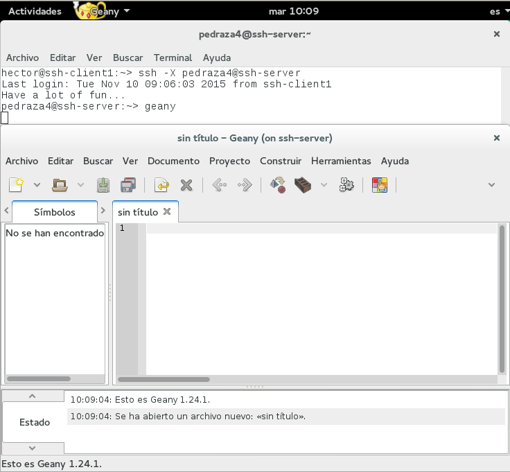

Y accedemos también con alguno de los usuarios no autorizados para comprobar que, efectivamente, no tenemos permiso para ejecutar el programa.

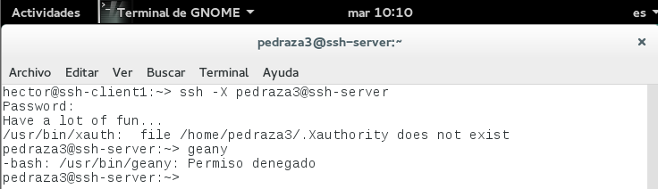

## 8. Conclusiones

El servicio ssh supone una herramienta de gran utilidad como administrador de sistemas. Quizá a nivel de usuario no resulta tan llamativa debido a la falta de entorno gráfico en las conexiones establecidas que sí aporta otras herramientas de acceso remoto como las basadas en RDP y VNC. 

Como administradores nos permite realizar accesos a aquellos equipos que tenemos que administrar simplemente con una consola de comandos y sin interrumpir la sesión que pueda estar abierta por el usuario, facilitando en gran medida las tareas propias de un administrador de sistemas.

Si además aumentamos la funcionalidad agregando la ejecución de aplicaciones remotas puede resultar en una herramienta de gran potencia para equipos informáticos que no requieran de un rendimiento elevado, como por ejemplo un entorno educativo.