# Administración de sistemas operativos

# Práctica 4.01 - Tareas programadas

## 1. S.O. OpenSUSE

### 1.1 Configuración de la máquina

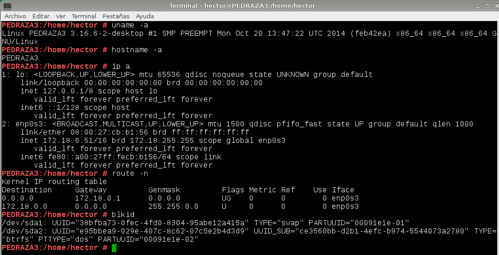

### 1.2 Tarea diferida

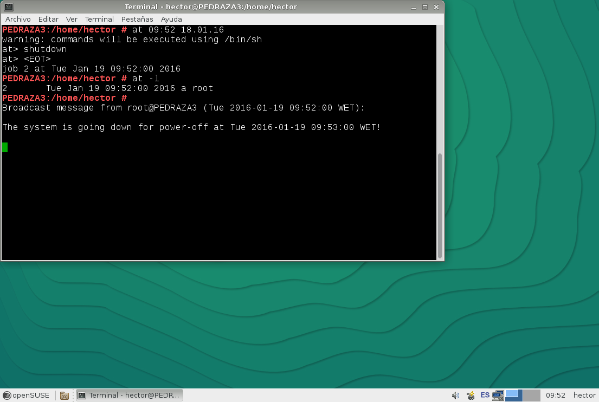

### 1.3 Tarea periódica

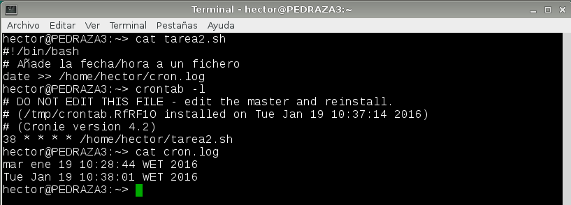

### 1.4 Tarea asícrona

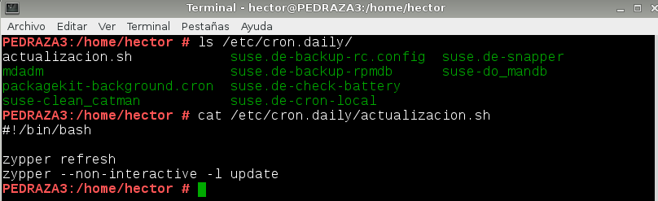

## 2. Windows

### 2.1 Configuración de la máquina

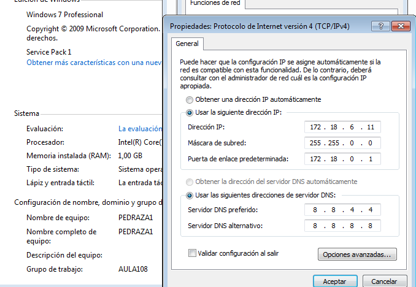

### 2.2 Tarea diferida

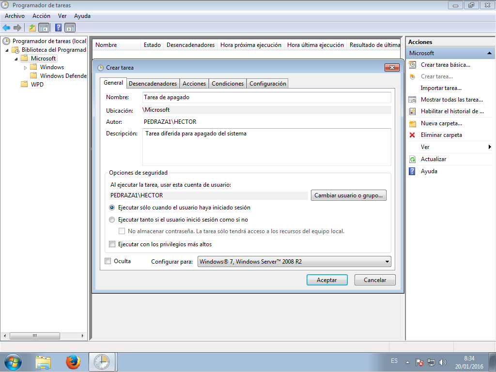

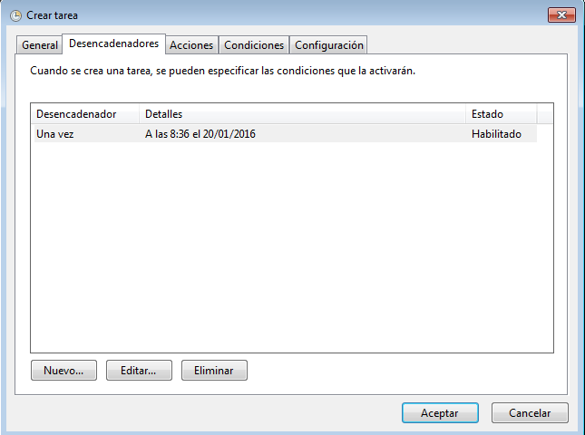

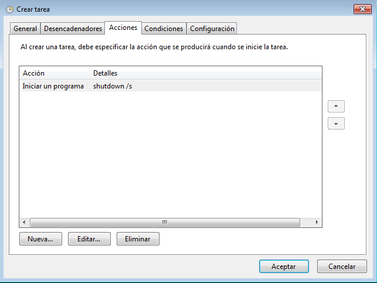

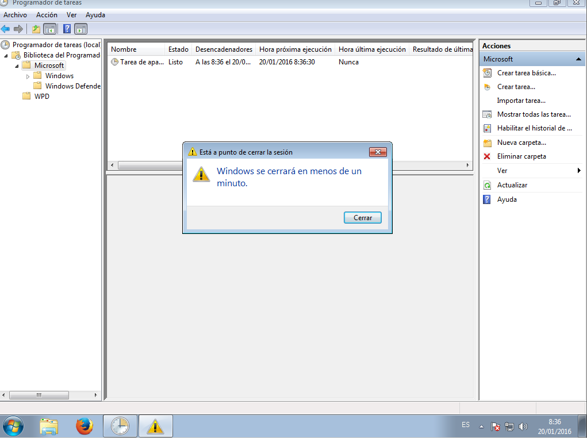

### 2.3 Tarea periódica

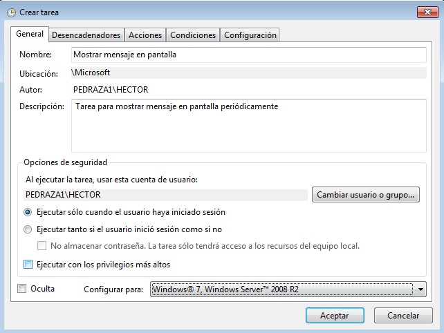

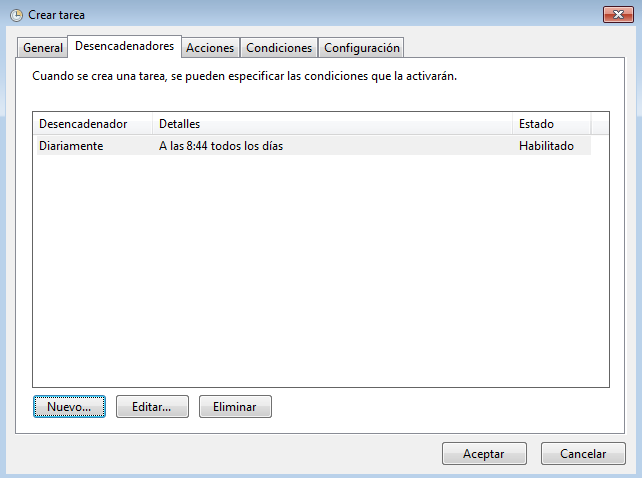

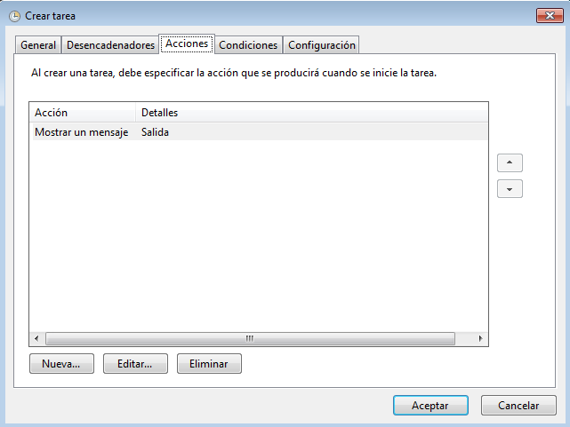

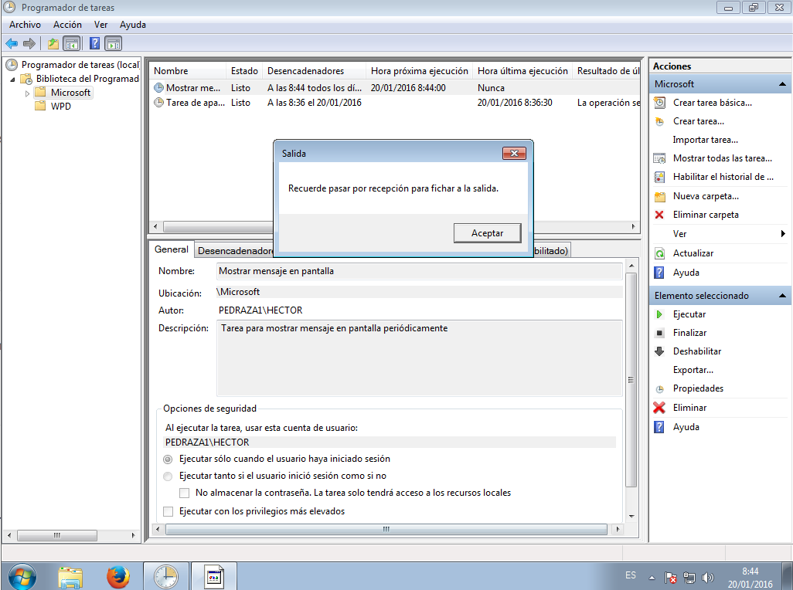

### 2.4 Tarea asíncrona

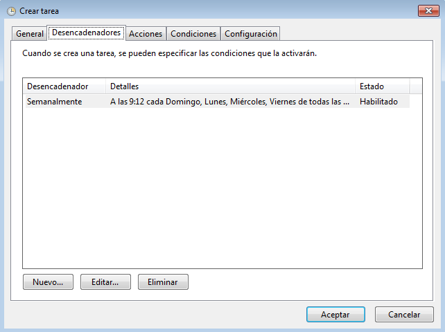

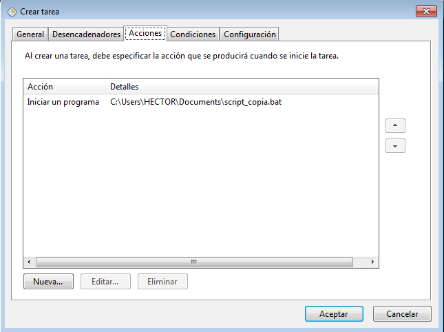

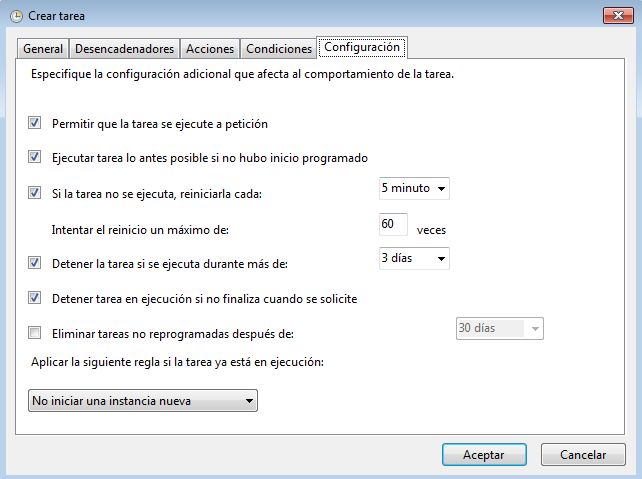

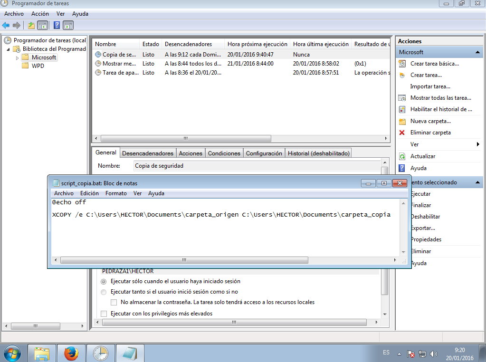

## 3. Conclusiones

