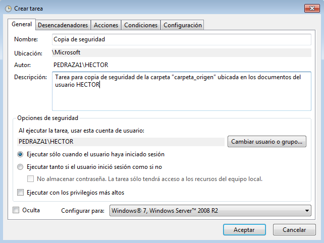

# Administración de sistemas operativos

# Práctica 4.01 - Tareas programadas

El objetivo de esta práctica consiste en tomar contacto con las herramientas de programación de tareas, tanto en linux (OpenSUSE) como en windows (Windows 7).

Como sabemos, podemos configurar varios tipos de tareas en función del momento en que queramos que se ejecuten: tareas diferidas, tareas periódicas y tareas asíncronas. En nuestro caso programaremos una tarea de cada tipo.

## 1. S.O. OpenSUSE

Comenzaremos realizando la práctica en OpenSUSE.

### 1.1 Configuración de la máquina

Lo primero que tenemos que hacer es establecer la configuración de red de la máquina tal y como viene en el enunciado. La configuración resultante es la siguiente.

### 1.2 Tarea diferida

Comenzaremos a programar tareas con la más sencilla: la tarea diferida. En nuestro caso vamos a especificar una tarea diferida que realice un apagado (`shutdown`) de la máquina en el momento que le especifiquemos.

Para este tipo de tareas tenemos la herramienta `at`. Lo primero que tenemos que asegurarnos es que el servicio de at se encuentra arrancado (demonio "atd"). 

Una vez comprobado, tenemos que ejecutar el comando `at` en la terminal, con los parámetros indicando la fecha y hora a la que queremos que se ejecute la tarea. Ejecutamos y nos aparece una nueva línea de comandos donde introduciremos la secuencia de comandos que ejecutará la tarea programada. Indicamos el comando `shutdown` y pulsamos CTRL+D para terminar.

Como vemos, cuando llega la hora indicada se ejecuta automáticamente la secuencia de comandos de la tarea.

***Nota***: Si queremos comprobar el listado de tareas diferidas activas podemos ejecutar el comando `at -l`.

### 1.3 Tarea periódica

Seguimos con la tarea periódica. Este tipo de tareas se ejecutará de forma repetitiva según las indicaciones que se le pasen. Por ejemplo, que se ejecute a las y media de cada hora, o el día 1 de cada mes. 

Para este tipo de tareas tenemos la herramienta `cron`. Esta herramienta nos permite almacenar un registro de tareas para cada usuario y programar la repetición de dichas tareas.

En nuestro caso vamos a crear una tarea periódica que se ejecute cada hora y escriba la hora del sistema en un fichero de "log" creado por nosotros. Para agregar la tarea al cron tenemos que ejecutar el comando `crontab -e`. Este comando nos crea un registro cron de tareas para el usuario con el que ejecutemos el comando o, si ya estaba creado, nos permite editarlo. 

Abrimos el registro y agregamos la línea correspondiente para que ejecute el script con las instrucciones que queremos.

***Nota***: si queremos listar las tareas de un crontab concreto podemos utilizar el comando `crontab -l`. Del mismo modo podemos borrar el listado completo con el comando `crontab -r`.

### 1.4 Tarea asíncrona

Terminamos con la definición de una tarea asíncrona. En este caso también utilizaremos la herramienta cron, ya que dispone de unos directorios específicos dentro de la carpeta `/etc` donde podemos guardar los scripts de órdenes que queramos que se ejecuten periódicamente y de forma asíncrona.

En nuestro caso crearemos un script que, diariamente, actualice los repositorios de descarga y actualice los programas instalados. Por tanto, tenemos que crear el script (recordar darle permisos de ejecución) e incluirlo en el directorio `/etc/cron.daily`.

***Nota***: del mismo modo, tenemos directorios al `cron.daily` para ejecuciones cada hora, semanalmente o mensualmente.

## 2. Windows

Ahora vamos a realizar las mismas configuraciones pero en la máquina Windows. En este caso no requerimos de utilizar varias herramientas. El sistema incluye la herramienta `Programador de tareas` que permite configurar las tareas de forma diferida, periódica o asíncrona según queramos.

Podemos encontrar esta herramienta en `Panel de control -> Herramientas administrativas -> Programador de tareas`. En el programador de tareas podemos crear la tarea a varios niveles, según las agrupaciones que queramos hacer. En nuestro caso vamos a incluirlas todas como tareas de windows.

### 2.1 Configuración de la máquina

Antes de ponernos con las tareas, vamos a establecer la configuración de red como corresponde.

### 2.2 Tarea diferida

Empezamos nuevamente con la tarea diferida. Vamos a definir una tarea de apagado del equipo. Para ello vamos a crear tarea básica y nos aparece un cuadro de diálogo donde comenzaremos a establecer la configuración.

### 2.3 Tarea periódica

### 2.4 Tarea asíncrona

## 3. Conclusiones

