# Administración de sistemas operativos

# Práctica 4.03 - Puppet

El objetivo de esta práctica es aprender el funcionamiento de la herramienta Puppet. Puppet es una herramienta de administración de la configuración de código libre y escrito en ruby.

Este tipo de herramientas permite establecer en una máquina maestro las configuraciones que queramos que se establezcan en las máquinas clientes que tengamos para luego aplicarlas a todas directamente, evitando tener que realizar las configuraciones individualmente para todas las máquinas que tengamos.

Para el desarrollo de la práctica utilizaremos 3 máquinas virtuales:
- Una primera máquina OpenSUSE que actuará como puppet master.
- Una segunda máquina OpenSUSE que actuará como cliente puppet.
- Una tercera máquina Windows 7 que también actuará como cliente puppet. 

## 1. Introducción

Comenzaremos estableciendo la configuración de las máquinas. Estableceremos la ip estática, con todas las máquinas en la misma red. No es necesario que todas las máquinas pertenezcan al mismo dominio, pero sí que puedan reconocerse por el nombre de host/netbios en cada caso.

Por tanto, además de establecer la configuración de red tenemos que agregar las líneas oportunas en el fichero de host de cada uno de los equipos.

### 1.1 Configuración de las máquinas

#### Master OpenSUSE

Comenzamos configurando la máquina servidor. 

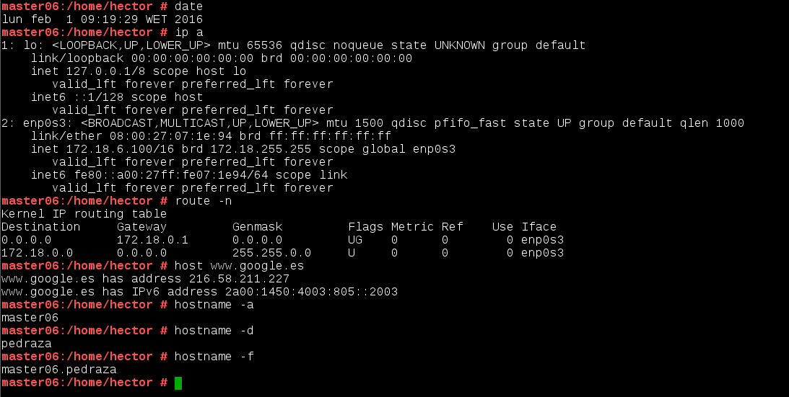

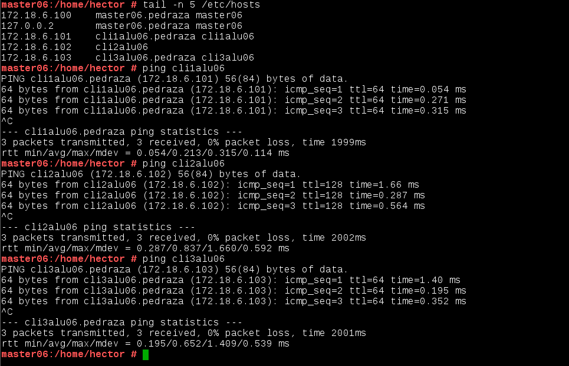

#### Agente OpenSUSE

Después configuramos la máquina cliente OpenSUSE.

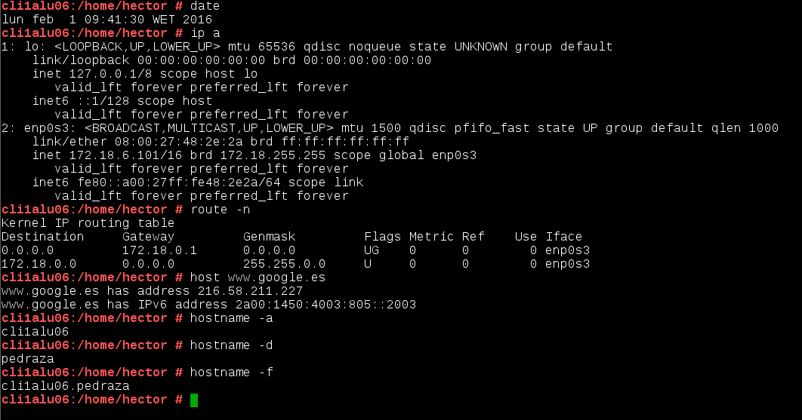

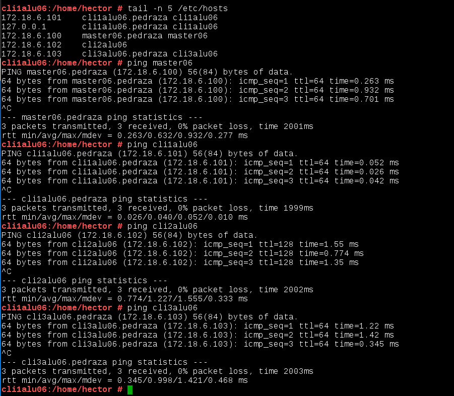

#### Agente Windows

Terminamos con la máquina windows.

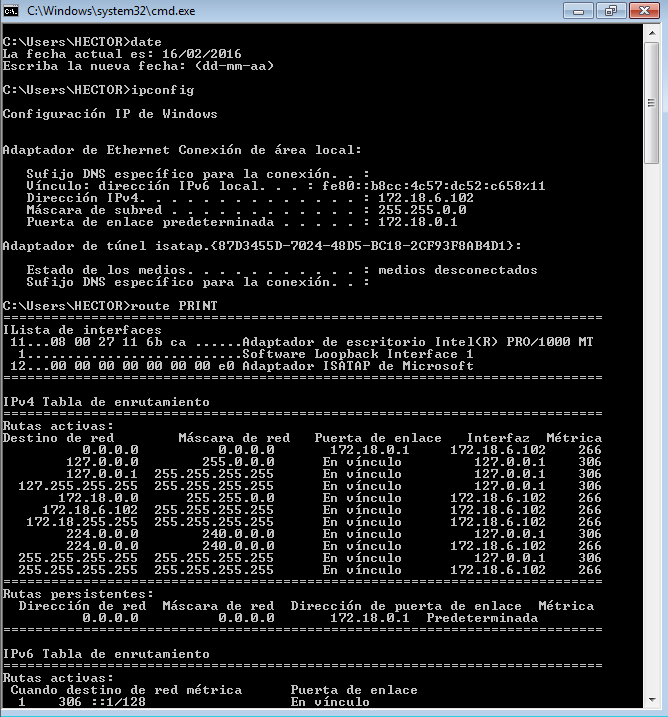

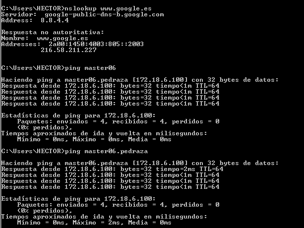

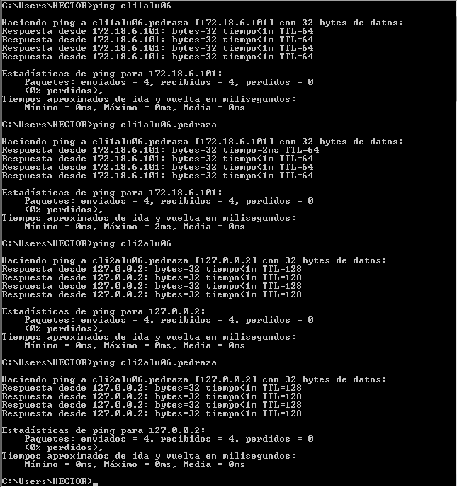

## 2. Primera versión del fichero pp

En este apartado vamos a instalar el maestro puppet y a configurar la estructura de ficheros donde guardaremos los ficheros de gestión de puppet.

Comenzamos instalando el servicio puppet. Podemos instalarlo mediante el comando `zypper install puppet-server puppet puppet-vim` o mediante el Gestor de software de YaST.

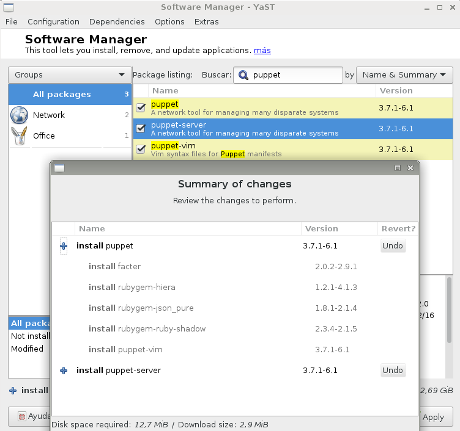

Después de la instalación, habilitamos y arrancamos el servicio `puppetmaster`.

A continuación creamos la estructura de ficheros del puppet. Como podemos comprobar, con la instalación se ha creado el directorio `/etc/puppet`, que es donde colgaran todos los ficheros de configuración del puppet. 

Creamos la carpeta `/etc/puppet/files` donde guardaremos documentos que queramos enviar a los clientes y, dentro de la carpeta `/etc/puppet/manifests`, creamos el directorio `classes`, donde incluiremos los ficheros de definición de los hosts.

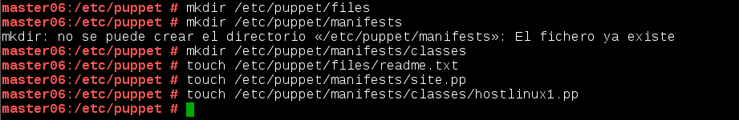

Luego creamos los ficheros `site.pp`, `readme.txt` y `hostlinux1.pp`.
*El fichero `readme.txt` incluirá texto para mostrar en el equipo al que lo incluyamos.
*El fichero `site.pp` es un fichero de puppet donde incluiremos los hosts que conectarán con el master y los ficheros de configuración que cargarán en cada caso.
*El fichero `hostlinux1.pp` será el fichero de configuración para el cliente OpenSUSE. 

El contenido de estos ficheros es el que sigue.

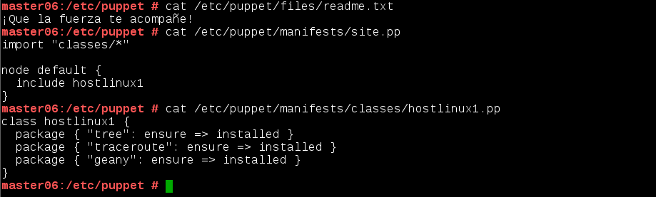

Cuando terminemos con los ficheros reiniciamos el servicio y comprobamos que se encuentra en funcionamiento.

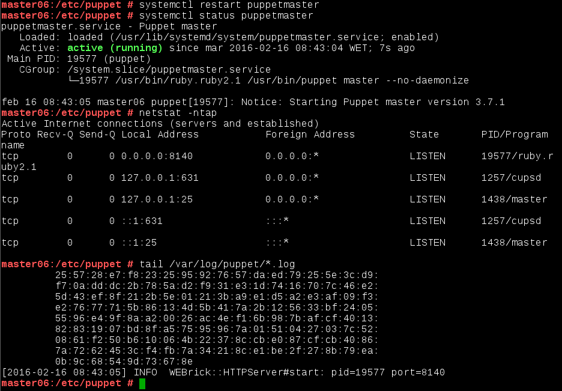

Para terminar, tenemos que generar la excepción en el cortafuegos de OpenSUSE para que permita las comunicaciones del servicio puppet. Vamos a YaST -> Cortafuegos -> Servicios Autorizados, seleccionamos los servicios de puppet, los agregamos y guardamos los cambios.

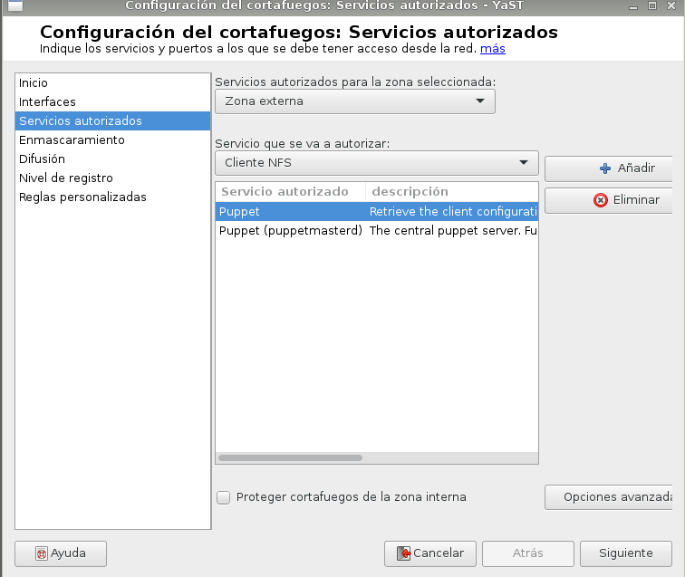

## 3. Instalación y configuración del cliente1

Ahora realizaremos la instalación del primer cliente puppet (OpenSUSE).

Ejecutamos el comando `zypper install puppet` y, cuando termine la instalación, tenemos que añadir una línea al comienzo del fichero `/etc/puppet/puppet.conf` indicando qué equipo será el máster del servicio.

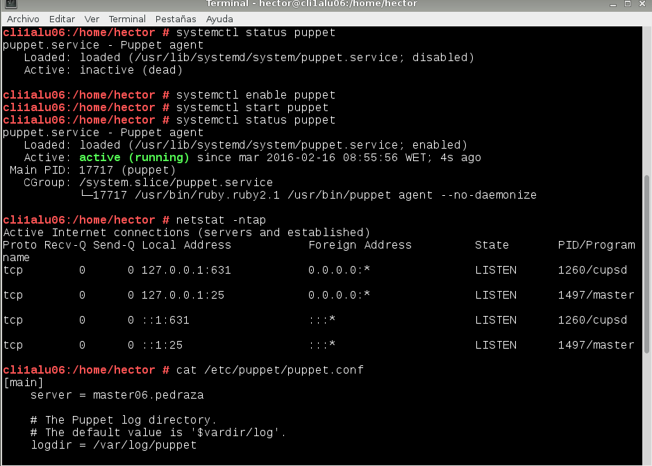

## 4. Certificados

Una vez configurado el cliente, tenemos que realizar el intercambio de certificados para que ambas máquinas, maestro y cliente, puedan comunicarse correctamente.

### 4.1. Aceptar certificado

En el máster, ejecutamos el comando `puppet cert list`. Este comando muestra los certificados de clientes que están pendientes de unión al máster.

Luego tenemos que aceptar el certificado que nos aparece. Para ello ejecutamos el comando `puppet cert sign nombre-host-cliente`. Podemos ejecutar el primer comando nuevamente para comprobar que no hay certificados pendientes de agregar y, después, el comando `puppet cert print nombre-host-cliente`.

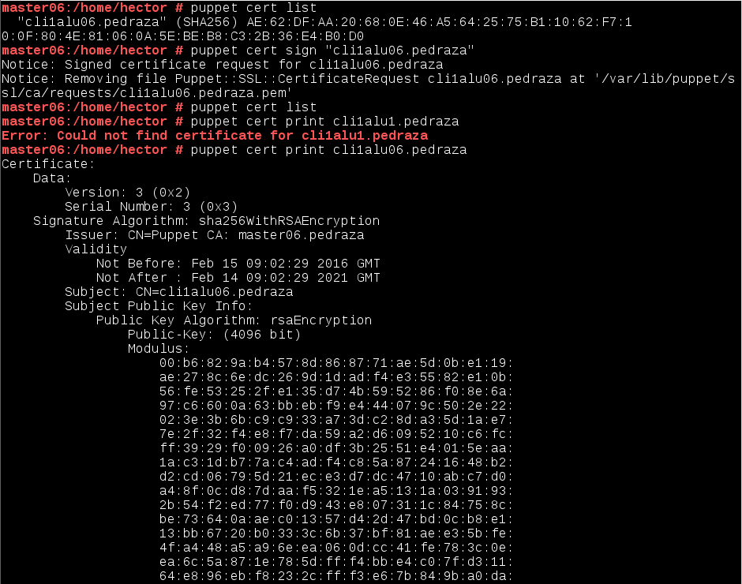

### 4.2. Comprobación final

Después de realizar el intercambio de certificados reiniciamos el servicio (o la máquina) máster y hacemos lo mismo con el cliente. Como el fichero de definición que indicamos para este cliente contiene la instalación de programas, comprobamos que se han instalado correctamente.

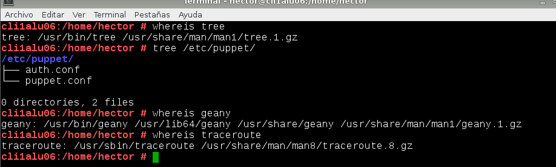

## 5. Segunda versión del fichero pp

Una vez comprobado el funcionamiento del servicio, vamos a generar un nuevo fichero de definición, más completo, y se lo adjudicaremos al cliente. 

El contenido del fichero de definición es el que sigue:

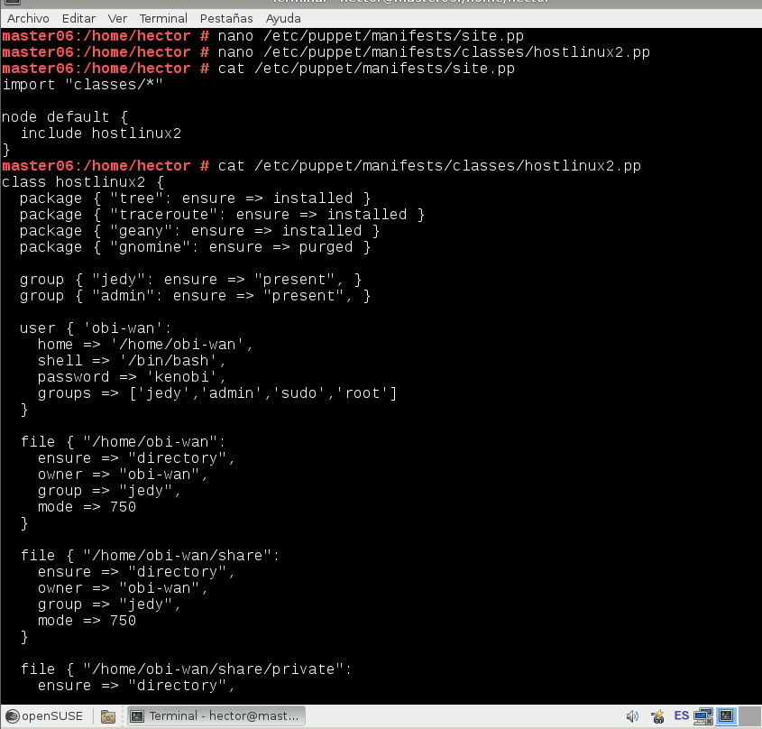

## 6. Cliente puppet windows

Para terminar vamos a configurar el cliente windows. 

Vamos a la página de puppet y descargamos el cliente. La versión que descarguemos debe coincidir con la que tengamos instalada en el máster. Para averiguar la versión del puppet podemos ejecutar el comando `facter`.

Descargamos la versión correspondiente y ejecutamos el instalador. Lo único que tenemos que indicar es el nombre del máster.

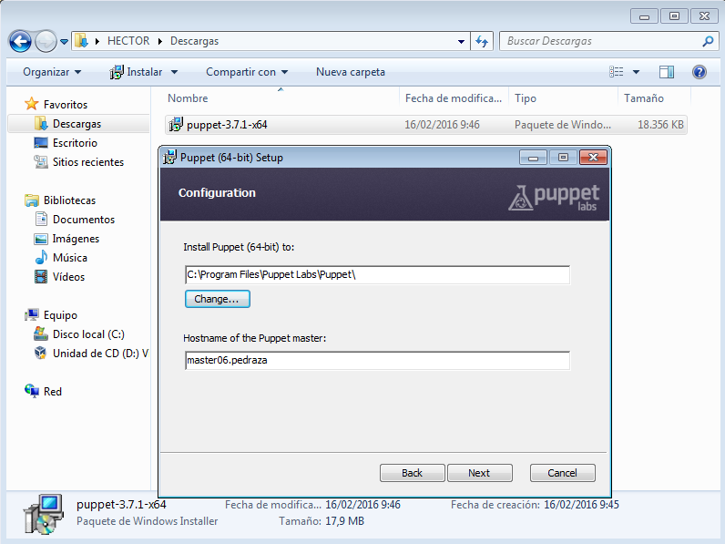

### 6.1. Modificaciones en el Máster

Ahora vamos al máster. Lo primero que vamos a hacer es crear el fichero de definición para el cliente windows e incluir la entrada correspondiente en el fichero `site.pp`.

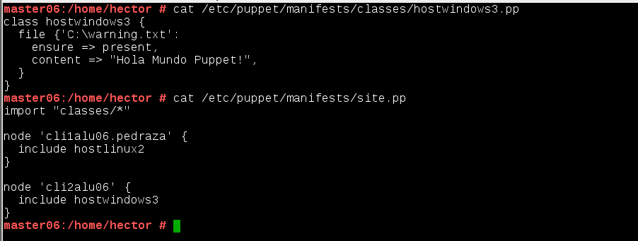

Ahora, tal como hicimos con el cliente openSUSE, aceptamos el certificado del cliente. Tener en cuenta que el cliente windows hay que indicarlo simplemente con el nombre netbios, sin workgroup ni nombre de dominio, ya que no tenemos un dominio creado.

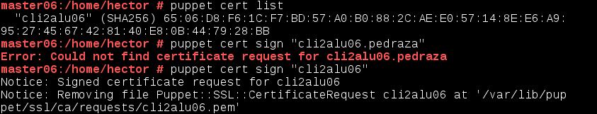

Comprobamos que el certificado se ha aceptado correctamente.

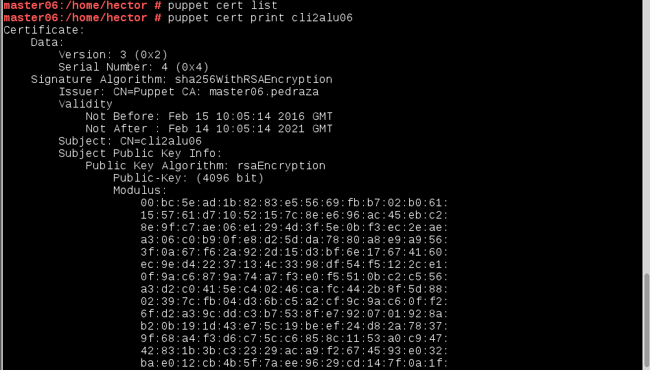

**Nota**: es posible que se produzca algún error durante el intercambio de certificados. Esto puede deberse a que no se ha indicado correctamente el nombre de la máquina, que el firewall ha impedido la comunicación... Sea el caso que se haya dado se debe realizar la conexión desde cero para que funcione correctamente. Para ello tenemos que seguir los siguientes pasos:

1. Eliminar el certificado del máster. Para esto tenemos que ejecutar dos comandos `puppet cert revoke "nombre-host-cliente"` y `puppet cert clean "nombre-host-cliente"`.
2. Desinstalar el cliente puppet de la máquina windows.
3. Eliminar los ficheros de configuración del puppet, que no se eliminan durante la desinstalación. Hay que eliminar 2 carpetas: la primera es la carpeta `.puppet` que se encuentra en la carpeta del usuario que estamos utilizando y la segunda es la carpeta `PuppetLabs` que se encuentra en `C:\ProgramData`.
4. Reiniciamos ambas máquinas y volvemos a realizar el proceso de instalación.

### 6.2. Modificaciones en el cliente2

Cuando tengamos el certificado funcionando correctamente abrimos la consola del cliente windows y ejecutamos el comando `puppet agent --test`. Con este comando forzamos a que se cargue la configuración establecida en el máster. Si todo ha ido bien (es posible que dé errores con los plugins, lo cual no nos afecta) se habrá creado el fichero "warning.txt" especificado en la configuración del cliente windows en la raíz del sistema.

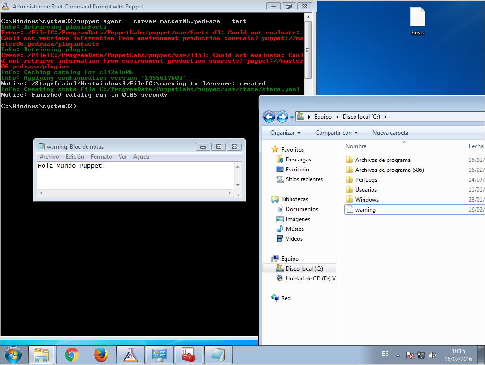

Una vez comprobado el funcionamiento, vamos a modificar el fichero de configuración del windows para que nos agregue 2 usuarios al sistema. El fichero de configuración debe de quedar como sigue.

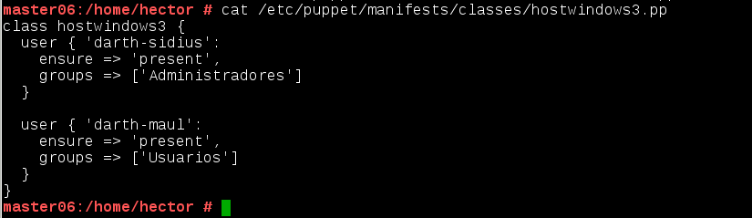

Ejecutamos el comando del agente y comprobamos que los usuarios se han creado correctamente.

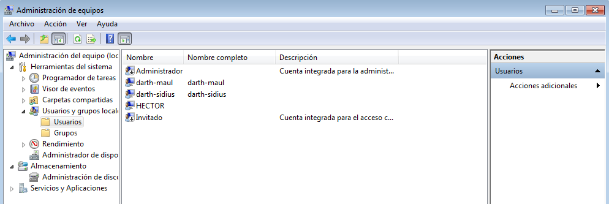

## 7. Conclusiones

