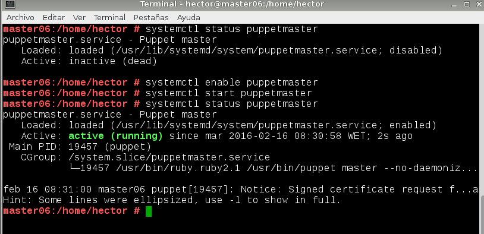

# Administración de sistemas operativos

# Práctica 4.03 - Puppet

## 1. Introducción

### 1.1 Configuración de las máquinas

#### Master OpenSUSE

#### Agente OpenSUSE

#### Agente Windows

## 2. Primera versión del fichero pp

### 2.1 readme.txt

### 2.2 site.pp

### 2.3 hostlinux1.pp

## 3. Instalación y configuración del cliente1

## 4. Certificados

### 4.1. Aceptar certificado

### 4.2. Comprobación final

## 5. Segunda versión del fichero pp

## 6. Cliente puppet windows

### 6.1. Modificaciones en el Master

### 6.2. Modificaciones en el cliente2

## 7. Entrega

